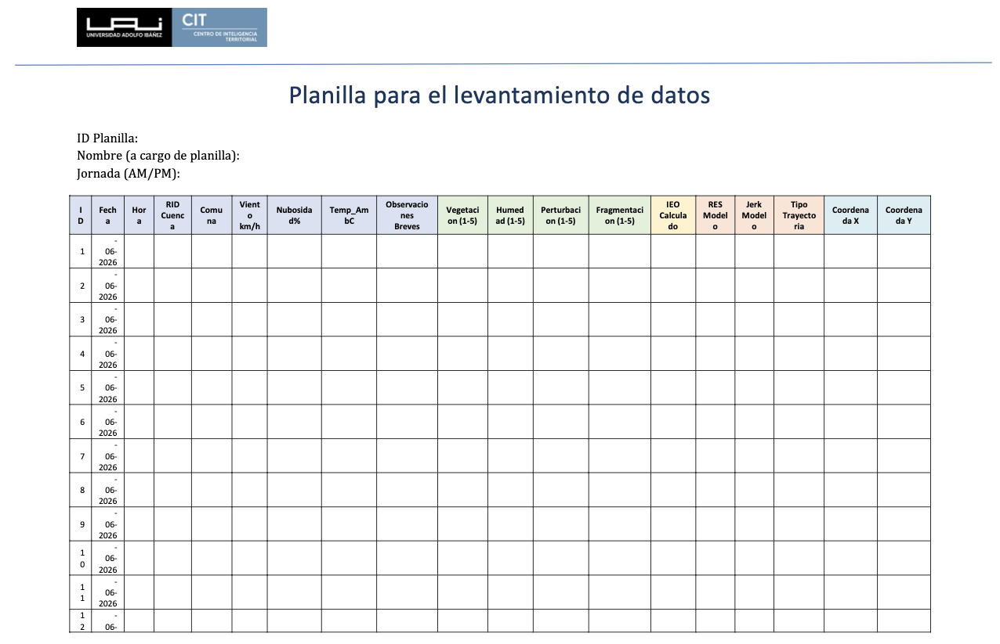

Este capítulo define la ficha mínima que debe acompañar cada cuenca visitada. Su función es ordenar el registro de terreno, no volver a explicar la selección de cuencas ni la rúbrica IEO. La selección técnica se presenta en @sec-diez-cuencas-jerk y @sec-terminales-h2-jerk; la decisión logística de campaña se define en @sec-decision-cuencas-finales; y la evaluación IEO se rige por @sec-rúbrica-ieo y @sec-formula-ieo.

::: {.callout-note}
## Uso de la ficha

Antes de salir a terreno se precargan los datos MRCT y la ubicación objetivo. En terreno se completan las condiciones ambientales, las observaciones breves y las cuatro notas IEO de cada punto de muestreo.
:::

## Variables de la ficha {#sec-variables-obligatorias-fichas}

Cada ficha debe mantener juntas las variables de identificación, precarga MRCT y registro de terreno. La tabla siguiente define los campos reales que deben aparecer en la ficha.

| Bloque | Variable | Llenado | Uso |
|---|---|---|---|
| Identificación | ID planilla | Gabinete | Identifica la planilla física o digital. |
| Identificación | Nombre a cargo de planilla | Gabinete / terreno | Define la persona responsable del registro. |
| Identificación | Jornada AM/PM | Terreno | Indica el bloque horario del levantamiento. |
| Registro de punto | `ID` | Terreno | Numera cada punto de muestreo dentro de la cuenca. |
| Registro de punto | Fecha | Terreno | Registra la fecha de observación. |
| Registro de punto | Hora | Terreno | Registra la hora local de observación. |
| Precarga de cuenca | `RID` | Gabinete | Identificador MRCT de la cuenca. |
| Precarga de cuenca | Cuenca | Gabinete | Nombre o etiqueta operativa de la cuenca. |
| Precarga de cuenca | Comuna | Gabinete | Comuna asociada al punto o cuenca. |
| Registro ambiental | Viento km/h | Terreno | Condición ambiental y restricción potencial para dron. |
| Registro ambiental | Nubosidad % | Terreno | Condición de visibilidad y comparabilidad. |
| Registro ambiental | `Temp_AmbC` | Terreno | Temperatura ambiente en grados Celsius. |
| Registro de punto | Observaciones breves | Terreno | Acceso, agua visible, nieve/hielo, perturbaciones, restricciones o representatividad. |
| IEO | Vegetación (1-5) | Terreno | Nota de vigor y cobertura vegetal según @sec-rúbrica-ieo. |
| IEO | Humedad (1-5) | Terreno | Nota de humedad superficial o agua visible según @sec-rúbrica-ieo. |
| IEO | Perturbación (1-5) | Terreno | Nota de impacto antrópico; vector negativo en @sec-formula-ieo. |
| IEO | Fragmentación (1-5) | Terreno | Nota de continuidad ecosistémica; vector negativo en @sec-formula-ieo. |
| IEO | IEO calculado | Gabinete / terreno | Índice observado calculado para el punto. |
| Precarga MRCT | `RES` modelo | Gabinete | Valor de resiliencia estimado por la MRCT. |
| Precarga MRCT | Jerk modelo | Gabinete | Señal dinámica que justifica o contextualiza la visita. |
| Precarga MRCT | Tipo trayectoria | Gabinete | Clasificación de trayectoria asociada a la cuenca. |
| Ubicación | Coordenada X | Gabinete / terreno | Coordenada objetivo o coordenada observada del punto. |
| Ubicación | Coordenada Y | Gabinete / terreno | Coordenada objetivo o coordenada observada del punto. |

: Variables reales de identificación, precarga y registro de terreno. {#tbl-campos-minimos-ficha}

Las columnas de terreno deben mantenerse alineadas con el protocolo: viento, nubosidad y temperatura se registran como condiciones ambientales (@sec-condiciones-ambientales-terreno); vegetación, humedad, perturbación y fragmentación se evalúan según la rúbrica IEO (@sec-rúbrica-ieo); y fotografías, dron, acceso, agua visible, nieve/hielo o dudas de representatividad se documentan en observaciones breves cuando no tengan una columna específica.

## Ficha tipo por cuenca {#sec-ficha-tipo-cuenca}

### Identificación y precarga

| Campo | Valor |
|---|---|
| ID planilla | Por definir |
| Nombre a cargo de planilla | Por definir |
| Jornada | AM / PM |
| `RID` | Por definir |
| Cuenca | Por definir |
| Comuna | Por definir |
| `RES` modelo | Por definir |
| Jerk modelo | Por definir |
| Tipo trayectoria | Por definir |
| Coordenada X objetivo | Por definir |
| Coordenada Y objetivo | Por definir |
| Criterio de selección | Referir a @sec-diez-cuencas-jerk, @sec-terminales-h2-jerk o @sec-decision-cuencas-finales |

: Identificación y precarga de la ficha de cuenca. {#tbl-ficha-identificacion-mrct}

### Registro de terreno

El registro debe completarse con 5 a 10 puntos de muestreo por cuenca, tal como define @sec-ieo-terreno. Al cierre de cada visita se revisa el control de completitud de @sec-control-completitud-terreno y luego la información se consolida en @sec-resultados-por-cuenca-terreno.

## Uso posterior {#sec-uso-posterior-fichas}

La ficha es la fuente primaria para la integración MRCT-terreno. Sus campos alimentan la síntesis de mediciones de @sec-sintesis-mediciones-terreno y la tabla de validación de @sec-tabla-validacion-mrct-terreno. La clasificación de consistencia no se decide en la ficha: se aplica posteriormente con los criterios de @sec-criterios-consistencia-mrct.

Las cuencas no visitadas, reemplazadas o descartadas también deben registrarse, indicando la causa principal: acceso, permiso, distancia, baja representatividad, riesgo, clima esperado o cambio de prioridad técnica.
