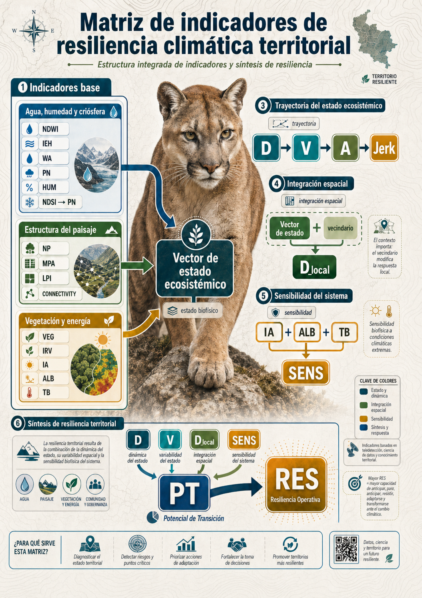

# Prefacio {.unnumbered}

 

[{fig-align="center" width="280"}](https://cit.uai.cl)

## Propósito

Este documento organiza la redacción de un libro digital técnico sobre la Matriz de Resiliencia Climática Territorial (MRCT).

El libro debe leerse como una secuencia lógica. Primero se presenta la región de estudio y las unidades de análisis. Luego se describen los insumos satelitales y se derivan los indicadores base. Después se construye el estado ecosistémico, se mide su trayectoria, se incorpora el espacio, se estima la sensibilidad y se sintetiza la resiliencia territorial.

## Estructura general del libro

1. Introducción
2. Región de estudio y unidades de análisis
3. Insumos satelitales e índices espectrales
4. Indicadores base
5. Vector de estado ecosistémico y línea base
6. Trayectoria del estado sistémico
7. Integración espacial
8. Sensibilidad del sistema
9. Síntesis de resiliencia territorial
10. Conclusiones

## Flujo general del modelo

