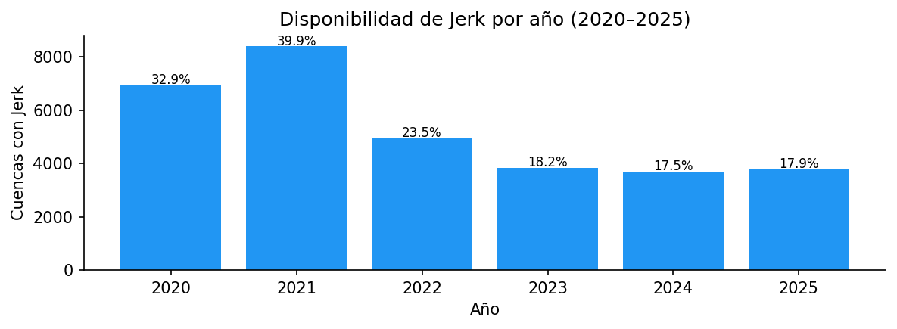
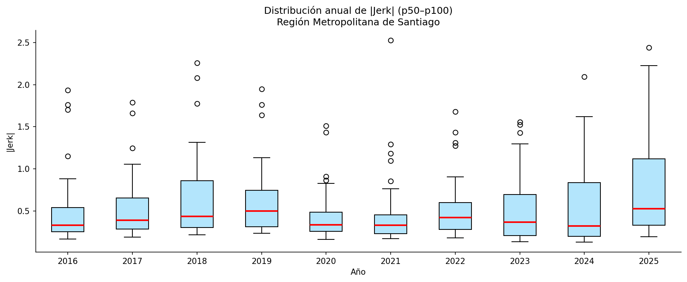
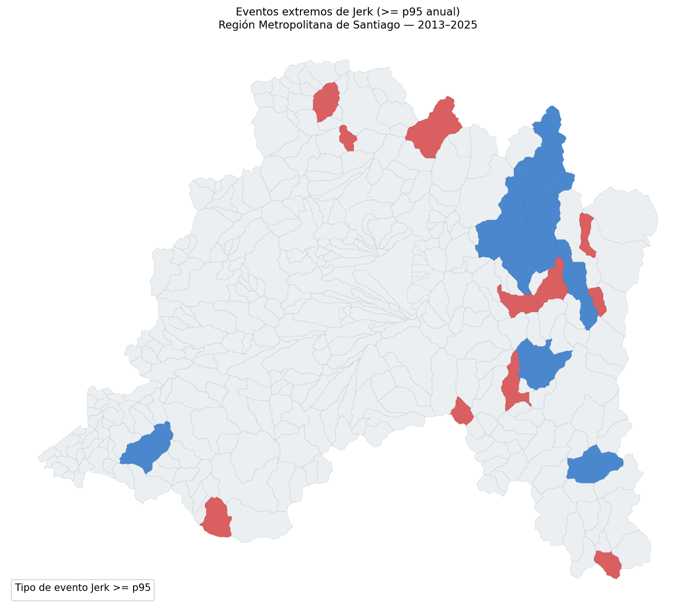
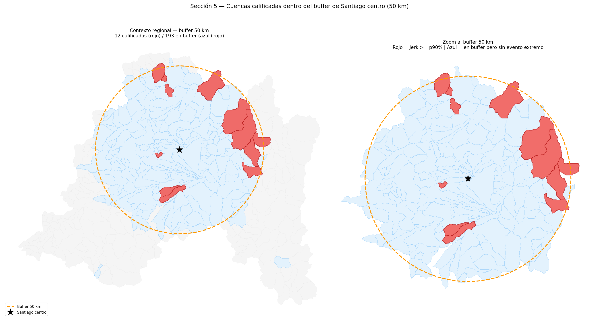
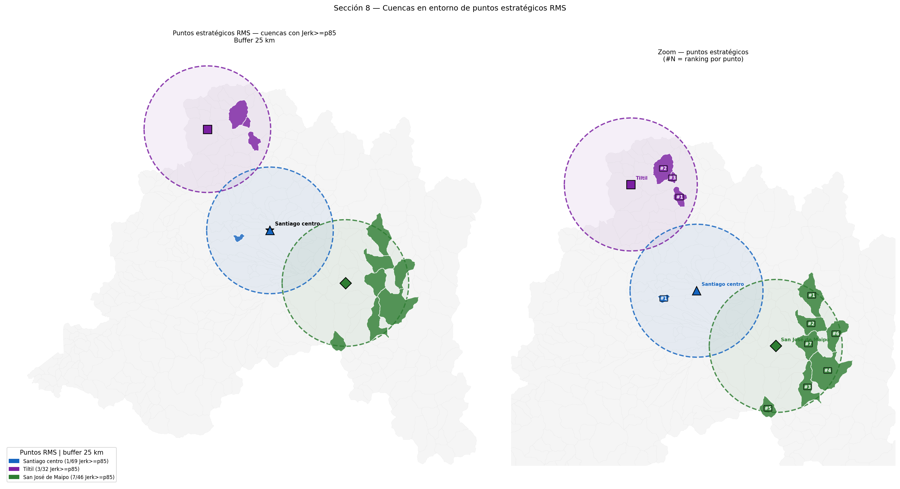

Este capítulo actualiza la selección de cuencas candidatas para validación territorial mediante el análisis de **jerk** de la Matriz de Resiliencia Climática Territorial. El objetivo es detectar cambios abruptos en la trayectoria ecosistémica y concentrar la priorización en el entorno operativo del centro metropolitano de Santiago.

La versión actual corresponde a la Región Metropolitana de Santiago. Además de seleccionar cuencas dentro de un buffer adaptativo alrededor del centro de Santiago, agrega una lectura por **puntos estratégicos RMS**: Santiago centro, Tiltil y San José de Maipo. Esta capa permite observar cuencas con cambios abruptos cerca de territorios relevantes para planificación urbana, presión logística-industrial y sensibilidad hídrica cordillerana.

::: {.callout-note}
## Alcance de la selección

La lista de cuencas prioritarias es una **preselección técnica**. No equivale a una ruta final de terreno ni a una evaluación de impacto ambiental. Antes de definir una campaña deben revisarse accesos reales, permisos, seguridad, propiedad, restricciones operativas, pertinencia territorial y conocimiento local.
:::

## Pregunta de trabajo {#sec-pregunta-jerk-terreno}

La pregunta que orienta esta versión del análisis es:

> ¿Qué cuencas del entorno metropolitano de Santiago muestran cambios abruptos recientes en su trayectoria ecosistémica, y cuáles de ellas se relacionan espacialmente con puntos estratégicos de la Región Metropolitana?

La pregunta se separa en cinco componentes:

- Identificar eventos abruptos medidos por jerk en la serie MRCT 2013-2025;
- distinguir entre intensificación y reversión de la trayectoria;
- filtrar cuencas dentro de un área operacional definida desde Santiago centro;
- ordenar las candidatas mediante un puntaje compuesto robusto a valores extremos;
- revisar cuencas cercanas a Santiago centro, Tiltil y San José de Maipo.

## Qué mide el jerk {#sec-criterio-jerk}

La MRCT calcula para cada cuenca y año una variable de dominio, `Domain` o $D$, que representa la distancia de la cuenca respecto de su estado ecosistémico de referencia. A partir de esa trayectoria se calculan derivadas temporales:

- $D$: distancia al régimen de referencia;
- $V$: velocidad de cambio de esa distancia;
- $A$: aceleración del cambio;
- $J$: cambio de la aceleración, o jerk.

En términos operativos, el jerk identifica una ruptura en la dinámica. Un valor alto en magnitud indica que la cuenca experimentó un salto abrupto en su trayectoria. Esa señal no debe interpretarse automáticamente como degradación, recuperación o causalidad comprobada: funciona como una alerta para mirar con mayor detalle.

```{mermaid}
%%| label: fig-derivadas-jerk
%%| fig-cap: "Derivadas temporales usadas para interpretar cambios abruptos en la trayectoria ecosistémica."
flowchart TB
  D["Domain (D)<br/>Distancia al <br/>estado de referencia"] --> V["Velocidad (dD/dt)<br/>Dirección y ritmo del cambio"]
  V --> A["Aceleración (d2D/dt2)<br/>Cambio en el ritmo"]
  A --> J["Jerk (d3D/dt3)<br/>Cambio abrupto <br/>en la aceleración"]
  J --> I["J > 0<br/>Intensificación"]
  J --> R["J < 0<br/>Reversión"]
```

El signo entrega una primera lectura:

| Tipo de evento | Condición | Lectura preliminar |
|---|---|---|
| Intensificación | $J > 0$ | Aceleración brusca del cambio respecto del dominio de referencia. Puede sugerir presión, perturbación o deterioro emergente. |
| Reversión | $J < 0$ | Frenada o inversión brusca de la trayectoria. Puede sugerir recuperación, estabilización, cambio de régimen o artefacto de datos. |

: Lectura básica del signo del jerk para selección de cuencas. {#tbl-signo-jerk}

Esta distinción es útil para terreno porque permite formular preguntas distintas. Una cuenca con intensificación puede requerir observar señales de presión reciente; una cuenca con reversión puede requerir revisar si existe recuperación visible, cambio hidrológico, variación de nieve, intervención local o inconsistencia en la serie satelital.

## Insumos y base analítica {#sec-estructura-datos-jerk}

El flujo usa dos insumos principales:

| Insumo | Contenido | Uso en el análisis |
|---|---|---|
| `MRCT_v1.xlsx` | Panel MRCT completo RMS, con 4.693 registros, 361 cuencas y 13 años. | Base temporal `RID x Year` para calcular eventos de jerk y cruzarlos con métricas MRCT. |
| `MRCT_v1.gpkg` | Geometría de 361 cuencas de la Región Metropolitana de Santiago. | Base espacial para centroides, distancias, macrozonas, buffers y mapas. |

: Insumos principales del análisis de cuencas prioritarias por jerk. {#tbl-insumos-jerk}

El panel completo cubre 2013-2025. Los primeros años no tienen jerk válido por definición, porque el cálculo necesita años previos para estimar la tercera derivada discreta. El análisis conserva la serie completa para control de calidad y lectura temporal, y luego usa eventos extremos y filtros espaciales para priorizar validación territorial.

La geometría fue transformada al sistema EPSG:32719, que permite trabajar en coordenadas métricas para calcular distancias aproximadas desde Santiago centro y desde cada punto estratégico.

```{mermaid}
%%| label: fig-flujo-base-jerk
%%| fig-cap: "Flujo lineal de construcción de la base analítica y productos de priorización."
flowchart TB
  config["Configuración<br/>rutas, coordenadas<br/>y parámetros"] --> data["Datos<br/>MRCT y cuencas RMS"]
  data --> parquet["Parquet<br/>lectura rápida"]
  parquet --> duck["DuckDB<br/>base analítica local"]
  duck --> qc["Control de calidad<br/>cobertura y clases"]
  qc --> events["Eventos de jerk<br/>percentiles anual y global"]
  events --> buffer["Buffer SCL<br/>radio adaptativo"]
  buffer --> score["P_score<br/>puntaje compuesto"]
  score --> top10["10 cuencas<br/>prioritarias"]
  top10 --> points["Puntos RMS<br/>buffers de 25 km"]
  points --> export["Exportación<br/>Excel, SHP y DuckDB"]
```

La base DuckDB queda organizada en seis tablas:

| Tabla | Contenido | Uso posterior |
|---|---|---|
| `mrct_panel` | Panel MRCT completo. | Consultar trayectorias, resiliencia, dominio, velocidad, aceleración y jerk. |
| `basins` | Atributos y geometría resumida de cuencas. | Construir mapas, cruces espaciales y visualizaciones. |
| `accessibility` | Centroide, distancia a Santiago centro, macrozona, anillo y pertenencia al núcleo cercano. | Filtrar cuencas por factibilidad preliminar. |
| `jerk_events` | Eventos con jerk no nulo, percentiles, signo y clase. | Identificar eventos extremos por año, macrozona o tipo de evento. |
| `field_priority` | Ranking final de las diez cuencas seleccionadas dentro del buffer. | Alimentar reportes, fichas de terreno y mapas. |
| `punto_results` | Cuencas calificadas por punto estratégico RMS. | Revisar señales ecosistémicas cerca de Santiago centro, Tiltil y San José de Maipo. |

: Esquema de tablas creado para sostener consultas posteriores. {#tbl-esquema-duckdb-jerk}

## Control de calidad y cobertura {#sec-control-calidad-jerk}

Antes de priorizar cuencas se revisó la disponibilidad anual de jerk. La tabla distingue el total regional de cuencas, las cuencas con jerk válido y el porcentaje de cobertura.

| Año | Cuencas totales | Cuencas con jerk | Cobertura |
|---:|---:|---:|---:|
| 2013 | 361 | 0 | 0,0% |
| 2014 | 361 | 0 | 0,0% |
| 2015 | 361 | 0 | 0,0% |
| 2016 | 361 | 113 | 31,3% |
| 2017 | 361 | 110 | 30,5% |
| 2018 | 361 | 110 | 30,5% |
| 2019 | 361 | 102 | 28,3% |
| 2020 | 361 | 99 | 27,4% |
| 2021 | 361 | 102 | 28,3% |
| 2022 | 361 | 94 | 26,0% |
| 2023 | 361 | 98 | 27,1% |
| 2024 | 361 | 104 | 28,8% |
| 2025 | 361 | 104 | 28,8% |

: Disponibilidad regional de jerk en la serie MRCT 2013-2025. {#tbl-disponibilidad-jerk}

La baja cobertura relativa obliga a usar percentiles con cautela. La ausencia de jerk válido en una cuenca no implica estabilidad ecosistémica; puede reflejar falta de datos suficientes, calidad de observación, restricciones de cálculo o problemas de disponibilidad en los insumos anuales.

{#fig-disponibilidad-jerk fig-align="center" width="85%"}

La distribución completa de clases en el panel es:

| Clase de jerk | Eventos |
|---|---:|
| Neutro | 3.893 |
| Reversión leve | 227 |
| Intensificación leve | 222 |
| Reversión fuerte | 179 |
| Intensificación fuerte | 172 |

: Distribución de clases de jerk en el panel MRCT RMS. {#tbl-clases-jerk}

## Eventos extremos de jerk {#sec-eventos-jerk}

El análisis materializó **1.036 eventos** con jerk no nulo en **130 cuencas**. Para cada evento se calcularon dos percentiles:

- percentil anual, que compara una cuenca con otras cuencas del mismo año;
- percentil global, que compara el evento con todos los eventos de la serie.

El percentil anual es el criterio principal de selección porque permite interpretar cada evento dentro de su contexto temporal. Un evento en p90 anual es relevante aunque el año completo haya sido menos activo que otros.

| RID | Año | Jerk | Tipo | Percentil anual | `RES` | Macrozona MRCT |
|---:|---:|---:|---|---:|---:|---|
| 22 | 2021 | 2,5275 | Intensificación | 100,0 | 0,00734 | Nororiente |
| 45 | 2025 | -2,4422 | Reversión | 100,0 | 0,01989 | Nororiente |
| 115 | 2018 | -2,2577 | Reversión | 100,0 | 0,07863 | Nororiente |
| 41 | 2025 | -2,2242 | Reversión | 99,0 | 0,15015 | Nororiente |
| 64 | 2025 | -2,2111 | Reversión | 98,1 | 0,08211 | Nororiente |
| 31 | 2024 | 2,0964 | Intensificación | 100,0 | 0,00144 | Nororiente |
| 64 | 2018 | -2,0824 | Reversión | 99,1 | 0,17379 | Nororiente |
| 31 | 2025 | -2,0356 | Reversión | 97,1 | 0,01735 | Nororiente |
| 115 | 2019 | 1,9488 | Intensificación | 100,0 | 0,20284 | Nororiente |
| 273 | 2016 | -1,9341 | Reversión | 100,0 | 0,02365 | Surponiente |

: Diez eventos regionales de mayor magnitud absoluta de jerk. {#tbl-top-eventos-jerk}

{#fig-distribucion-jerk-anual fig-align="center" width="95%"}

{#fig-eventos-regionales-jerk fig-align="center" width="90%"}

## Buffer operacional de Santiago centro {#sec-cruce-territorial-jerk}

La nueva versión del análisis usa un criterio único: **top 10 por `P_score` dentro del área operacional de Santiago centro**.

Una cuenca entra al conjunto candidato si cumple al menos una de estas condiciones:

- está dentro del núcleo cercano al centro metropolitano (`dist_scl_km <= 25`);
- su centroide está dentro del radio operativo adaptativo desde Santiago centro.

El notebook explora combinaciones de radio y percentil anual. La combinación escogida fue **50 km** y **jerk igual o superior al p90 anual**, porque es el radio más pequeño evaluado que garantiza más de diez cuencas calificadas con el umbral más exigente posible.

| Radio | Umbral anual | Cuencas calificadas |
|---:|---:|---:|
| 25 km | p90 | 1 |
| 25 km | p75 | 3 |
| 50 km | p90 | 12 |
| 75 km | p90 | 30 |
| 100 km | p90 | 36 |

: Exploración de parámetros para el buffer operativo de Santiago centro. {#tbl-parametros-buffer-jerk}

```{mermaid}
%%| label: fig-ajuste-buffer-jerk
%%| fig-cap: "Lógica de diagnóstico del buffer operativo y ajuste de parámetros."
flowchart TB
  start["Parámetros iniciales<br/>radios 25, 50, 75, 100 km<br/>umbrales p90, p85, p80, p75"] --> count["Contar cuencas calificadas"]
  count --> decision{"Hay al menos<br/>10 candidatas?"}
  decision -- "Si" --> choose["Elegir radio menor<br/>con umbral mas exigente"]
  decision -- "No" --> relax["Ampliar radio o relajar umbral"]
  relax --> count
  choose --> result["Resultado usado<br/>50 km + p90 anual<br/>12 cuencas"]
```

{#fig-buffer-jerk fig-align="center" width="100%"}

## Puntaje de priorización {#sec-puntaje-jerk}

Para pasar desde eventos individuales a cuencas candidatas se construyó un puntaje compuesto, denominado `P_score`. En esta versión, el puntaje se calcula **exclusivamente sobre las 12 cuencas calificadas del buffer**, no sobre todo el conjunto regional.

$$P = 0,35 \cdot J^* + 0,20 \cdot R^* + 0,15 \cdot E^* + 0,15 \cdot L^* + 0,15 \cdot A^*$$

| Componente | Variable base | Peso | Qué representa |
|---|---|---:|---|
| $J^*$ | `jerk_pct_global` | 0,35 | Magnitud relativa del evento abrupto. |
| $R^*$ | `PT` | 0,20 | Potencial de transición o vulnerabilidad ecosistémica. |
| $E^*$ | `Domain_local` | 0,15 | Diferencia de la cuenca respecto de su entorno local. |
| $L^*$ | `SENS` | 0,15 | Sensibilidad climática o exposición a forzantes. |
| $A^*$ | `1 - dist_scl_km` | 0,15 | Accesibilidad relativa dentro del conjunto candidato. |

: Componentes del puntaje compuesto de prioridad. {#tbl-pesos-prioridad-jerk}

Los componentes se normalizan por rango percentil dentro del buffer. Esto evita que valores extremos dominen la escala y hace que las dimensiones sean comparables. El rango observado de `P_score` fue de **0,300 a 0,746**.

{#fig-pscore-buffer-jerk fig-align="center" width="100%"}

## Diez cuencas candidatas {#sec-diez-cuencas-jerk}

La tabla siguiente presenta las diez cuencas priorizadas por el flujo actualizado. Todas fueron seleccionadas por `P_score` dentro del conjunto candidato del buffer de Santiago centro.

| Prioridad | RID | Macrozona MRCT | Año crítico | Jerk | Percentil anual | Tipo de evento | `RES` | Distancia a SCL (km) | Anillo | `P_score` |
|---:|---:|---|---:|---:|---:|---|---:|---:|---|---:|
| 1 | 31 | Nororiente | 2024 | 2,0964 | 100,0 | Intensificación | 0,00144 | 42,5 | Intermedio | 0,7458 |
| 2 | 66 | Nororiente | 2025 | -1,5283 | 95,2 | Reversión | 0,00730 | 38,4 | Intermedio | 0,7292 |
| 3 | 22 | Nororiente | 2021 | 2,5275 | 100,0 | Intensificación | 0,00734 | 35,8 | Intermedio | 0,7250 |
| 4 | 194 | Suroriente | 2017 | 0,8781 | 95,5 | Intensificación | 0,00175 | 26,6 | Intermedio | 0,6000 |
| 5 | 97 | Nororiente | 2025 | -1,7825 | 96,2 | Reversión | 0,02205 | 39,9 | Intermedio | 0,5958 |
| 6 | 117 | Nororiente | 2018 | -1,3085 | 94,5 | Reversión | 0,03430 | 43,3 | Intermedio | 0,5292 |
| 7 | 19 | Norponiente | 2017 | 0,9399 | 96,4 | Intensificación | 0,01319 | 47,6 | Intermedio | 0,4667 |
| 8 | 114 | Norponiente | 2017 | 0,8508 | 95,5 | Intensificación | 0,04513 | 12,6 | Cercano | 0,4417 |
| 9 | 133 | Nororiente | 2024 | 1,2571 | 97,1 | Intensificación | 0,08190 | 44,8 | Intermedio | 0,4083 |
| 10 | 188 | Suroriente | 2016 | -0,7487 | 91,2 | Reversión | 0,05473 | 25,5 | Intermedio | 0,4083 |

: Diez cuencas candidatas para validación territorial según el flujo actualizado. {#tbl-diez-cuencas-prioritarias}

La selección muestra una mezcla de intensificaciones y reversiones fuertes, con predominio de cuencas de resiliencia muy baja o `Colapso_Potencial`. La señal se concentra especialmente en Nororiente, pero incluye cuencas Suroriente y Norponiente. La única cuenca del top 10 en anillo cercano es RID 114; el resto pertenece al anillo intermedio, por lo que la planificación logística debe revisar acceso real y tiempo de traslado.

{#fig-top10-jerk fig-align="center" width="100%"}

## Lectura de series temporales {#sec-series-temporales-jerk}

Para las tres cuencas de mayor puntaje se revisaron series temporales completas 2013-2025 de `Domain`, `Velocidad`, `Aceleracion`, `Jerk` y `RES`. Esta lectura es necesaria porque un ranking por jerk puede seleccionar picos aislados. La serie permite distinguir si el evento abrupto aparece como una ruptura puntual, una intensificación dentro de una tendencia o una reversión después de varios años de alejamiento del dominio.

{#fig-series-top3-jerk fig-align="center" width="100%"}

Esta lectura debe repetirse para cualquier cuenca que pase a planificación de terreno. Una cuenca no debería visitarse solo porque aparece en el top 10; debería visitarse porque su serie temporal formula una pregunta territorial clara.

## Puntos estratégicos RMS {#sec-puntos-estrategicos-rms}

La nueva versión del notebook agrega una lectura específica para tres puntos de referencia territorial de la Región Metropolitana. La lógica es preventiva: las cuencas cercanas a puntos relevantes que ya muestran jerk elevado constituyen zonas donde conviene levantar una línea base territorial más cuidadosa.

| Punto | Latitud | Longitud | Rol analítico |
|---|---:|---:|---|
| Santiago centro | -33,4489 | -70,6693 | Núcleo urbano y administrativo. |
| Tiltil | -33,0850 | -70,9270 | Borde norte con presión logística e industrial. |
| San José de Maipo | -33,6400 | -70,3520 | Cabecera cordillerana y sensibilidad hídrica. |

: Puntos estratégicos incorporados al análisis RMS. {#tbl-puntos-estrategicos-rms}

Para cada punto se construyó un buffer de **25 km**. Dentro de ese radio se seleccionaron cuencas con jerk igual o superior al **p85 anual** y se ordenaron por `P_score` cuando estaba disponible.

| Punto | Cuencas en buffer | Cuencas con jerk >= p85 | RID superior | Jerk del RID superior | `RES` | Clase |
|---|---:|---:|---:|---:|---:|---|
| Santiago centro | 69 | 1 | 114 | 0,8508 | 0,04513 | Intensificación fuerte |
| Tiltil | 32 | 3 | 22 | 2,5275 | 0,00734 | Intensificación fuerte |
| San José de Maipo | 46 | 7 | 117 | -1,3085 | 0,03430 | Reversión fuerte |

: Resumen de cuencas calificadas por punto estratégico RMS. {#tbl-resumen-puntos-rms}

| Punto | Ranking | RID | Macrozona MRCT | Año crítico | Jerk | Tipo | Distancia al punto (km) | `P_score` |
|---|---:|---:|---|---:|---:|---|---:|---:|
| Santiago centro | 1 | 114 | Norponiente | 2017 | 0,8508 | Intensificación | 12,6 | 0,4417 |
| Tiltil | 1 | 22 | Nororiente | 2021 | 2,5275 | Intensificación | 19,0 | 0,7250 |
| Tiltil | 2 | 19 | Norponiente | 2017 | 0,9399 | Intensificación | 13,6 | 0,4667 |
| Tiltil | 3 | 17 | Nororiente | 2017 | 0,6526 | Intensificación | 15,9 | 0,3000 |
| San José de Maipo | 1 | 117 | Nororiente | 2018 | -1,3085 | Reversión | 23,3 | 0,5292 |
| San José de Maipo | 2 | 133 | Nororiente | 2024 | 1,2571 | Intensificación | 15,7 | 0,4083 |
| San José de Maipo | 3 | 242 | Suroriente | 2024 | 1,3628 | Intensificación | 19,5 | NA |
| San José de Maipo | 4 | 210 | Suroriente | 2025 | -1,1949 | Reversión | 21,6 | NA |
| San José de Maipo | 5 | 256 | Suroriente | 2016 | 0,8267 | Intensificación | 23,6 | NA |
| San José de Maipo | 6 | 164 | Nororiente | 2019 | 0,7510 | Intensificación | 23,1 | NA |
| San José de Maipo | 7 | 185 | Suroriente | 2016 | 0,5189 | Intensificación | 12,3 | NA |

: Primeras cuencas calificadas por punto estratégico RMS. {#tbl-top-puntos-rms}

{#fig-puntos-estrategicos-rms fig-align="center" width="100%"}

## Uso en planificación territorial {#sec-uso-terreno-jerk}

La selección por jerk debe alimentar una reunión técnica y territorial antes de definir rutas. En esa revisión se recomienda trabajar con cuatro listas:

- **lista prioritaria**, con las diez cuencas del ranking del buffer de Santiago centro;
- **lista logística**, con cuencas cercanas o visitables dentro del mismo recorrido;
- **lista estratégica RMS**, con cuencas próximas a Santiago centro, Tiltil y San José de Maipo;
- **lista de reemplazo**, con cuencas alternativas por si falla el acceso, el clima o el permiso.

La reunión debe revisar caminos, huellas, portones, predios, restricciones de propiedad, áreas protegidas, infraestructura, posibilidad de vuelo de dron, puntos seguros de medición, pertinencia territorial y antecedentes locales de incendios, inundaciones, sequías, obras, extracción, urbanización, remoción en masa o nieve persistente.

El producto esperado no es reemplazar el ranking, sino convertirlo en un plan de campaña realista: qué cuencas se visitan, cuáles quedan como respaldo, qué hipótesis se validan y qué observaciones se necesitan en cada sitio.

## Fichas de terreno derivadas {#sec-fichas-jerk}

Cada cuenca que avance a terreno debe transformarse en una ficha operativa. La base generada por este análisis permite precargar `RID`, macrozona MRCT, año crítico, tipo de evento, Jerk, `RES`, coordenadas, distancia a Santiago centro y contexto de punto estratégico cuando corresponda.

La estructura única de registro se define en @sec-ficha-tipo-cuenca. Este capítulo aporta la señal analítica; la ficha convierte esa señal en observaciones de terreno comparables mediante el protocolo IEO descrito en @sec-ieo-terreno. Así se evita que el equipo reciba sólo coordenadas y se asegura que cada visita tenga una pregunta de validación explícita.

## Productos exportados {#sec-productos-jerk}

La nueva versión del flujo exporta productos tabulares, espaciales y consultables:

| Producto | Formato | Contenido |
|---|---|---|
| `cuencas_prioritarias_jerk_10_rms.xlsx` | Excel | Hojas `Buffer_top10`, `Puntos_RMS` y `Eventos_reg_p95`. |
| `cuencas_prioritarias_top10_rms.shp` | Shapefile | Geometría de las diez cuencas prioritarias. |
| `cuencas_puntos_estrategicos_rms.shp` | Shapefile | Geometría de cuencas calificadas por punto estratégico. |
| `mrct_jerk_analysis_rms.db` | DuckDB | Tablas analíticas para consulta posterior. |

: Productos exportados por el notebook actualizado. {#tbl-productos-jerk}

## Limitaciones {#sec-limitaciones-jerk}

El análisis tiene limitaciones que deben mantenerse visibles:

- el jerk detecta discontinuidades, no causas;
- un evento extremo puede deberse a cambio ecológico real, ruido, nube, nieve, mosaico débil, cambio de cobertura temporal o efecto metodológico;
- la distancia a Santiago centro y a puntos estratégicos se calculó como aproximación euclidiana, no como tiempo real de viaje;
- la agregación por macrozona MRCT no reemplaza comunas ni límites administrativos oficiales;
- el análisis de puntos estratégicos es una lectura espacial preliminar y no reemplaza evaluación ambiental, modelación hidrológica ni línea base de proyecto;
- la selección no incorpora todavía permisos, propiedad, estado de caminos, conocimiento local ni seguridad de vuelo;
- las coberturas anuales de jerk son incompletas, por lo que los percentiles deben interpretarse como señales de priorización y no como diagnóstico definitivo.

Estas limitaciones no invalidan el análisis. Definen su uso correcto: una herramienta para orientar dónde mirar primero, qué preguntas llevar a terreno y dónde conviene anticipar una línea base más fina.

## Cierre operativo {#sec-cierre-jerk}

La selección actualizada convierte el panel MRCT RMS en una agenda preliminar de validación territorial. El procesamiento identificó eventos abruptos, construyó una base consultable, priorizó diez cuencas del entorno operativo de Santiago centro y agregó una lectura estratégica para Santiago centro, Tiltil y San José de Maipo.

El siguiente paso no es salir directamente a esas diez cuencas ni asumir impacto por proximidad a un punto estratégico. El paso correcto es someter la lista a revisión aplicada: accesibilidad real, conversación con actores locales, evaluación de rutas, permisos, clima, seguridad, pertinencia territorial y contraste con antecedentes urbanos, productivos e hidrológicos. Con esa revisión, el ranking puede transformarse en un plan de terreno con sitios principales, sitios alternativos y preguntas de validación claras.
