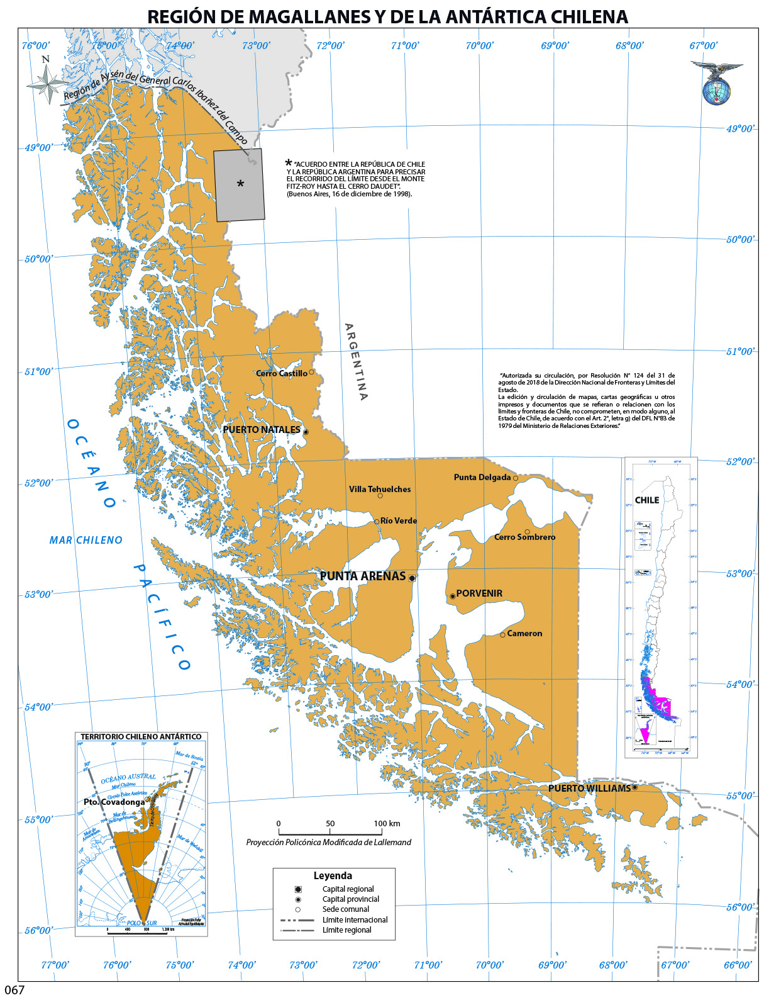
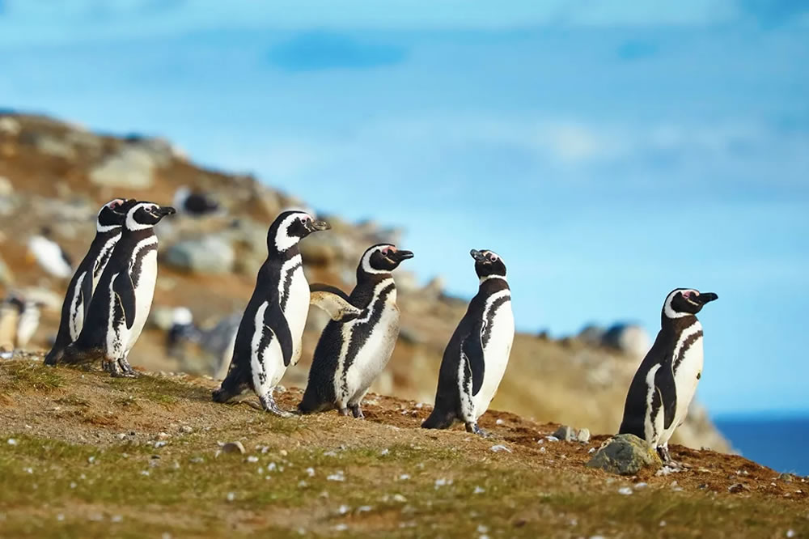
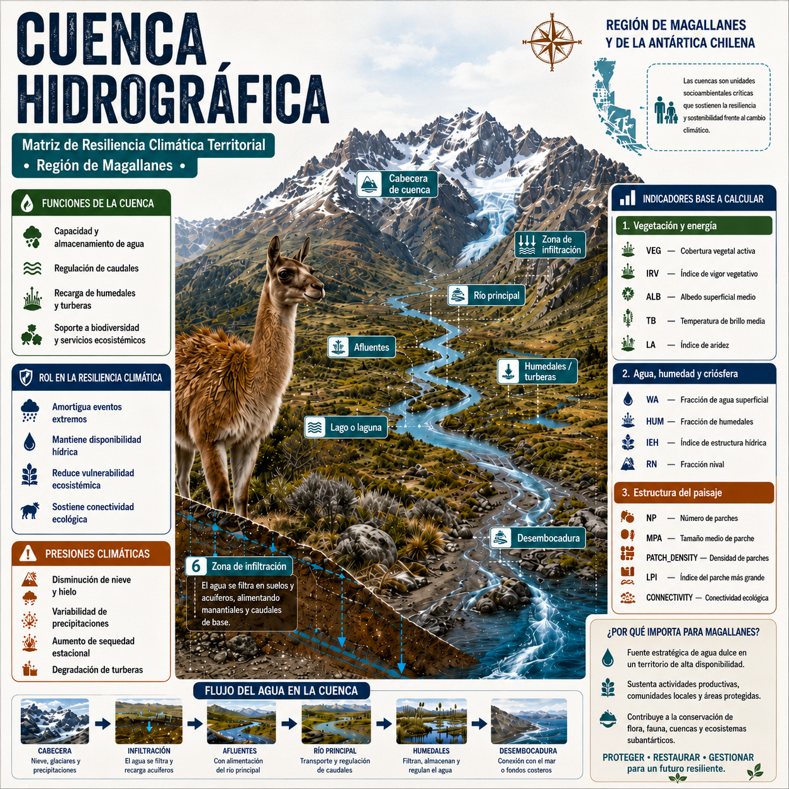

Antes de describir los índices espectrales, es necesario precisar el territorio sobre el que opera la MRCT y la unidad espacial que organiza sus resultados. El modelo no trabaja sobre píxeles aislados ni sobre divisiones administrativas: agrega la información satelital a cuencas hidrográficas, entendidas como unidades funcionales donde se conectan relieve, escorrentía, cobertura terrestre, criósfera, ecosistemas y presencia humana.

## Región de estudio

La Región de Magallanes y de la Antártica Chilena se ubica en el extremo austral de Chile y constituye uno de los territorios más extensos, remotos y ambientalmente heterogéneos del país. Su sector sudamericano se extiende aproximadamente entre los 48°36' y 56°30' de latitud sur, y entre los 66°25' y 75°40' de longitud oeste. Administrativamente se organiza en cuatro provincias —Última Esperanza, Magallanes, Tierra del Fuego y Antártica Chilena— y once comunas, con Punta Arenas como capital regional [@bcn_magallanes_region].

{#fig-mapa-region-magallanes fig-align="center" width="90%"}

La región posee una superficie total de **1.382.291,10 km²**, de los cuales **132.291,10 km²** corresponden al territorio sudamericano y **1.250.000 km²** al Territorio Chileno Antártico [@bcn_magallanes_region]. Para efectos de este libro, el levantamiento satelital y la construcción de indicadores se concentran en las cuencas hidrográficas del sector sudamericano. Esta delimitación permite trabajar sobre unidades territoriales comparables, con continuidad espacial y pertinencia para el análisis ecosistémico regional.

Desde el punto de vista físico, Magallanes reúne archipiélagos, fiordos, canales, cordones montañosos, campos de hielo, estepas frías, turberas, bosques subantárticos, lagos, glaciares y extensas zonas costeras. Esta diversidad produce contrastes marcados entre el occidente húmedo y fragmentado por canales, el eje cordillerano y glaciar, y el oriente más seco y estepario. Para la MRCT, esa heterogeneidad es central: los indicadores de vegetación, agua, nieve, aridez, temperatura y estructura del paisaje se leen dentro de un mosaico ecológico de alta variabilidad interna.

{#fig-fiordos-magallanes fig-align="center" width="90%"}

El clima regional es templado frío, ventoso y de baja amplitud térmica, con abundante nubosidad y máximos invernales de precipitación. Hacia el oriente de la cordillera predominan condiciones estepáricas frías, con menor humedad y mayor exposición al viento [@mma_sinca_magallanes]. Esta gradiente climática incide directamente en la lectura satelital: la nubosidad reduce ventanas de observación; la nieve y el hielo modifican la reflectancia superficial; las diferencias de humedad alteran la señal hídrica y vegetal; y los contrastes térmicos se expresan en la temperatura superficial observada.

La hidrografía regional presenta una organización singular. Buena parte de los cursos principales se ubican hacia el sector oriental o transandino y varios sistemas drenan finalmente hacia el Atlántico. Entre las hoyas relevantes se encuentran los ríos Serrano, Gallegos, Chico o Ciaike, San Juan y otras cuencas menores al sur del Estrecho de Magallanes. El río Serrano, asociado al Campo de Hielo Sur y al sistema de lagos Toro, Sarmiento, Pehoé y Nordenskjöld, es un ejemplo de la conexión entre criósfera, lagos, escorrentía y paisaje glaciar [@bcn_magallanes_hidrografia].

La criósfera es uno de los componentes ambientales más importantes para comprender la resiliencia regional. Según el Inventario Público de Glaciares informado por la Dirección General de Aguas, Magallanes concentra **7.055 glaciares** y una superficie glaciarizada de **10.426,6 km²**, equivalente a casi la mitad de la superficie glaciarizada nacional [@dga_magallanes_glaciares]. Por esta razón, la fracción nival, el albedo, la temperatura superficial y los cambios en agua superficial son variables especialmente relevantes para seguir transformaciones ecosistémicas asociadas a pérdida de hielo, variabilidad hídrica y cambios de cobertura.

{#fig-iceberg-magallanes fig-align="center" width="90%"}

El valor ecológico de Magallanes también se expresa en su alto nivel de protección ambiental. La región concentra la mayor extensión de territorio protegido de Chile y contiene áreas de conservación, parques nacionales, reservas, monumentos naturales, ecosistemas marinos, bosques subantárticos, turberas y ambientes glaciares [@sbap_magallanes_2026]. Esta condición refuerza la necesidad de indicadores reproducibles que permitan observar cambios territoriales sin depender únicamente de campañas de terreno, especialmente en zonas de difícil acceso.

{#fig-pinguinos-magallanes fig-align="center" width="90%"}

La dimensión social y demográfica agrega otra capa de contexto. El Censo 2024 registró **166.537 personas** en la región, con una estructura altamente concentrada en centros urbanos y una densidad muy baja si se considera la superficie total regional [@ine_censo2024_magallanes; @bcn_magallanes_region]. Punta Arenas y Natales concentran la mayor parte de la población, mientras amplios sectores rurales, insulares y de estepa presentan baja ocupación permanente. Este patrón de poblamiento influye en la presión territorial, en la accesibilidad para validación de campo y en la forma en que los resultados de la MRCT pueden apoyar decisiones públicas.

La base económica regional combina actividades urbanas, portuarias, logísticas, turísticas, ganaderas, energéticas e industriales. La extracción de hidrocarburos y gas natural, la ganadería ovina, el turismo de naturaleza y los servicios asociados a conectividad austral conviven con áreas de alto valor ecológico y baja intervención directa. En términos de resiliencia territorial, esta combinación exige distinguir entre cambios ecosistémicos propios de la variabilidad climática, transformaciones asociadas a presión productiva y dinámicas espaciales vinculadas a infraestructura, accesibilidad y ocupación humana.

| Dimensión regional | Relevancia para la MRCT |
|---|---|
| Gran extensión y baja densidad poblacional | Requiere monitoreo remoto sistemático y comparable. |
| Gradiente oeste-este de humedad y estepa | Afecta vegetación, agua superficial, aridez y temperatura. |
| Presencia de glaciares, nieve y campos de hielo | Hace centrales los indicadores de criósfera, albedo y agua. |
| Alta nubosidad y clima ventoso | Condiciona la construcción de mosaicos anuales robustos. |
| Cuencas con drenajes complejos | Justifica trabajar con unidades hidrográficas como base territorial. |
| Áreas protegidas y ecosistemas sensibles | Exige trazabilidad y cautela en la interpretación de cambios. |
| Poblamiento concentrado y territorios aislados | Refuerza el valor de productos cartográficos para gestión pública. |

: Dimensiones regionales relevantes para la lectura territorial de la MRCT. {#tbl-dimensiones-region}

## Cuencas hidrográficas como unidad territorial

Una cuenca hidrográfica es el territorio que drena sus aguas hacia un punto o sistema común. Sus límites se definen por divisorias de agua y no por límites administrativos. Por eso es una unidad adecuada para integrar variables de vegetación, humedad, nieve, temperatura, escorrentía y estructura del paisaje: todos esos componentes participan en una misma organización física del territorio.

En la MRCT, cada cuenca funciona como unidad mínima de agregación territorial. Los píxeles satelitales se procesan en su grilla original, pero los indicadores finales se resumen por cuenca y año. Esta decisión reduce el ruido propio del píxel individual, permite comparar unidades de tamaño y comportamiento distintos, y mantiene una lectura coherente con procesos hidrológicos y ecosistémicos.

El enfoque se apoya en una lectura de **panarquía territorial**: los sistemas ecológicos no operan en una sola escala ni como unidades cerradas. Una cuenca local se conecta con subcuencas, cursos principales, zonas lacustres, fiordos, borde costero y océano. Por ello, la MRCT entiende lo hidrológico como un continuo entre continente y océano, donde los cambios de cobertura, nieve, agua superficial o temperatura pueden propagarse entre niveles espaciales y afectar la resiliencia del sistema completo.


{#fig-cuenca fig-align="center" width="100%"}

Esta lectura también orientó la construcción geométrica de las unidades. Se usó batimetría extensa para mantener la continuidad espacial del camino del agua y evitar artefactos producidos por recortes de insumos altimétricos, como puede ocurrir cuando un modelo de elevación terrestre se corta abruptamente en la línea de costa. En territorios australes con fiordos, canales, islas y drenajes complejos, ese recorte puede generar límites artificiales o interrumpir conexiones hidrológicas reales. La extensión batimétrica permite conservar la relación funcional entre continente, borde costero y cuerpos marinos interiores, manteniendo la coherencia espacial del flujo hídrico con independencia de fronteras administrativas, recortes técnicos o límites naturales aparentes.

Las cuencas utilizadas por el Centro de Inteligencia Territorial mantienen atributos de referencia con los códigos oficiales de cuencas y subcuencas de la Dirección General de Aguas. Es decir, cada cuenca CIT conserva como atributos los códigos DGA correspondientes, lo que permite conectar el análisis MRCT con el Inventario Público de Cuencas Hidrográficas y Lagos [@dga_inventario_cuencas_lagos]. Esta trazabilidad facilita el cruce con información pública, reportes sectoriales y marcos oficiales de gestión hídrica.

## Grilla espacial y atributos de análisis

El flujo MRCT trabaja con un raster de cuencas alineado (`basins_aligned.tif`). En esta capa, cada píxel contiene el identificador de la cuenca a la que pertenece. Ese identificador, denominado `RID`, permite agregar los valores de los índices espectrales desde la grilla satelital hacia una tabla longitudinal de cuenca por año.

La grilla de cuencas actúa como referencia espacial del modelo. Todas las capas anuales se alinean a esa geometría para asegurar que cada píxel de NDVI, NDWI, NDSI, NDDI, albedo o temperatura de brillo corresponda exactamente a la misma unidad territorial. Sin esta condición, la comparación entre capas podría mezclar píxeles de cuencas distintas o introducir errores de borde.

{#fig-grilla-huella-antropica fig-align="center" width="100%"}

```{mermaid}
flowchart LR
    A[Cuencas CIT<br/>con atributos DGA] --> B[Raster de cuencas<br/>basins_aligned.tif]
    B --> C[Identificador RID<br/>por píxel]
    C --> D[Agregación anual<br/>por cuenca]
    D --> E[Panel RID × año<br/>para la MRCT]
```

## Huella antrópica y población

Además de la grilla de cuencas, el flujo MRCT incorpora una capa territorial de **huella antrópica** (`anthropic_aligned.tif`). Esta capa no reemplaza a los índices espectrales; opera como una máscara previa que define qué píxeles se consideran válidos para estimar los indicadores base por cuenca.

La huella antrópica se construyó integrando tres fuentes oficiales de ocupación y uso del territorio: el Catastro de Uso de la Tierra y Recursos Vegetacionales de Chile disponible en el Sistema de Información Territorial de CONAF [@conaf_sit_2020], el Continuo de Construcciones Urbanas del Geoportal Open Data MINVU [@minvu_ccu_2021] y la Carta de Ocupación de Tierras consultada desde el GEOPORTAL SIMBIO del Ministerio del Medio Ambiente [@mma_simbio_2026]. En conjunto, estas capas permiten representar la presencia de infraestructura, áreas urbanas, coberturas intervenidas y patrones de ocupación humana que pueden modificar la señal ecosistémica observada por el satélite.

La cobertura resultante se expresa como un raster continuo normalizado entre **0 y 1**. Valores cercanos a **0** representan píxeles sin intervención humana relevante o con intervención muy baja; valores intermedios indican presencia parcial o difusa de ocupación antrópica; y valores cercanos a **1** representan intervención alta, como construcciones urbanas, infraestructura o coberturas fuertemente transformadas. En la configuración por defecto del modelo, el umbral seleccionado es:

$$
\theta_{ant} = 0{,}2
$$

Con este criterio, se conserva para el cálculo de índices base sólo el subconjunto de píxeles con huella antrópica **menor o igual a 0,2**. Los píxeles con valores superiores a 0,2 se excluyen de la estimación de los indicadores ecosistémicos, aunque siguen siendo información territorial relevante para interpretar presión humana, escenarios prospectivos y decisiones de gestión.

Este filtro es importante porque la MRCT busca medir resiliencia ecosistémica y no confundirla con cambios producidos directamente por urbanización, infraestructura o uso intensivo del suelo. Sin esta máscara, una cuenca con mayor proporción de asentamientos humanos podría mostrar menor vegetación, mayor temperatura superficial, fragmentación o cambios hídricos por razones asociadas al poblamiento y no necesariamente por pérdida de resiliencia ecológica. Al separar la señal natural de la señal antrópica directa, el modelo mantiene una lectura más consistente de la condición ecosistémica.

La decisión también permite incorporar explícitamente el **factor humano**. La población no se trata como un elemento externo al territorio: su distribución, concentración urbana e infraestructura asociada forman parte de la presión territorial que debe ser considerada. En Magallanes, donde la población se concentra principalmente en Punta Arenas, Natales y otros centros urbanos, este filtro ayuda a distinguir entre cuencas dominadas por procesos naturales y sectores donde la ocupación humana tiene mayor peso en la señal observada.
