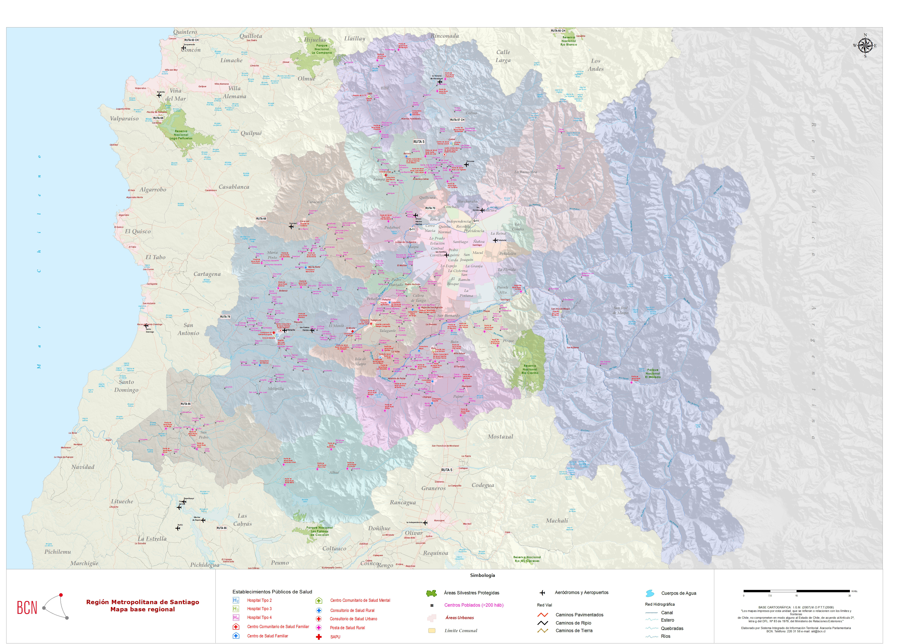
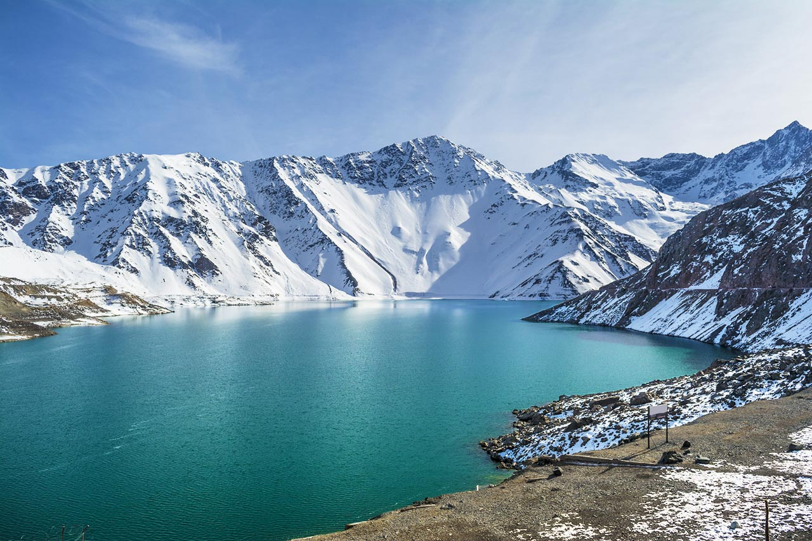
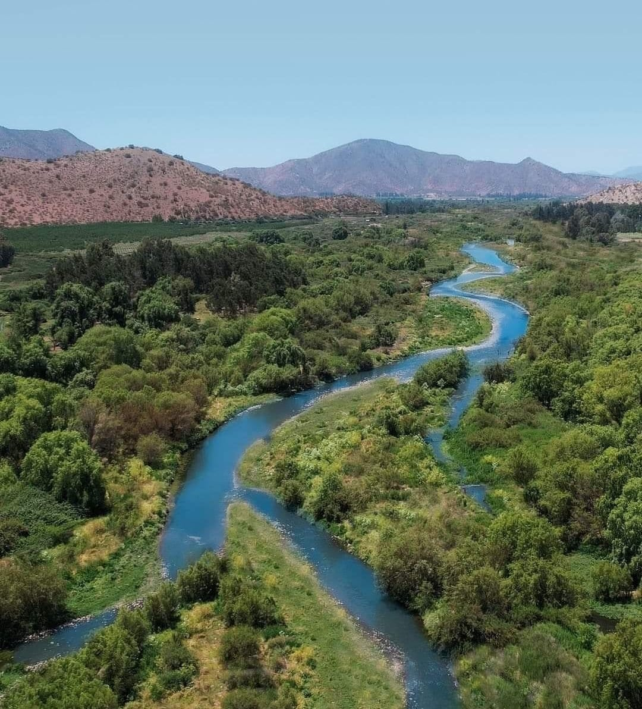

Antes de describir los índices espectrales, es necesario precisar el territorio sobre el que opera la MRCT y la unidad espacial que organiza sus resultados. El modelo no trabaja sobre píxeles aislados ni sobre divisiones administrativas: agrega la información satelital a cuencas hidrográficas, entendidas como unidades funcionales donde se conectan relieve, escorrentía, cobertura terrestre, criósfera, ecosistemas y presencia humana.

## Región de estudio

La Región Metropolitana de Santiago se ubica en la zona central de Chile y es la única región mediterránea del país. Se extiende aproximadamente entre los **32°55' y 34°19' de latitud sur**, y entre los **69°47' y 71°43' de longitud oeste**. Limita al norte y al oeste con la Región de Valparaíso, al sur con la Región del Libertador General Bernardo O'Higgins y al este con la República Argentina. Administrativamente se organiza en seis provincias —Santiago, Cordillera, Chacabuco, Maipo, Melipilla y Talagante— y 52 comunas [@bcn_rms_region].

{#fig-mapa-region-rms fig-align="center" width="90%"}

La región posee una superficie de **15.403,20 km²**, equivalente al **2,0%** del territorio nacional. A pesar de su tamaño relativo reducido, concentra la mayor población del país: el Censo 2024 registró **7.400.741 habitantes**, equivalentes al **40%** de las personas censadas en Chile, con una densidad regional de **480,47 habitantes por km²** [@bcn_rms_region; @ine_censo2024_chile]. Para efectos de este libro, el levantamiento satelital y la construcción de indicadores se concentran en cuencas hidrográficas de la región, de modo que la lectura ecosistémica pueda relacionar la condición natural con una de las mayores concentraciones urbanas, productivas e infraestructurales del país.

Desde el punto de vista físico, la Región Metropolitana se organiza en tres grandes unidades de relieve: la Cordillera de los Andes al oriente, la Cuenca de Santiago en la depresión intermedia y la Cordillera de la Costa al poniente. La cordillera andina regional alcanza altitudes superiores a 5.000 y 6.000 metros en cumbres como Tupungato, San José, Maipo, Nevado de los Piuquenes, Juncal y El Plomo; la Cuenca de Santiago se ubica entre la Cordillera de la Costa y las primeras estribaciones andinas; y la Cordillera de la Costa forma un cordón compacto que cierra la cuenca por el oeste [@bcn_rms_relieve]. Para la MRCT, esta estructura topográfica es central porque ordena gradientes de nieve, agua, temperatura, vegetación, aridez y presión urbana.

{#fig-embalse-yeso-rms fig-align="center" width="90%"}

El clima regional es de tipo mediterráneo, con estación seca prolongada e invierno lluvioso. La Biblioteca del Congreso Nacional reporta una temperatura media anual cercana a **13,9 °C**, un mes más cálido en enero y un mes más frío en julio; también registra precipitaciones anuales medias del orden de **356,2 mm**, con alta irregularidad interanual. En la cuenca de Santiago se expresan diferencias locales asociadas al relieve, la continentalidad, la barrera de la Cordillera de la Costa y el clima frío de altura sobre los 3.000 metros en la Cordillera de los Andes [@bcn_rms_clima]. Esta condición justifica que la MRCT incorpore aridez, albedo, temperatura de brillo, nieve y agua superficial como señales anuales sensibles a variabilidad climática.

Los impactos climáticos recientes refuerzan esta necesidad de monitoreo. El Plan de Acción Regional de Cambio Climático de la Región Metropolitana reconoce disminución de precipitaciones, aumento de hasta **2,0 °C** en la temperatura media anual y reducción significativa de la nieve en la Cordillera de los Andes como efectos relevantes para la región [@gore_rms_parcc_2024]. En términos de resiliencia territorial, esos cambios pueden modificar simultáneamente la disponibilidad hídrica, la vegetación mediterránea, la temperatura superficial y la continuidad ecológica de las cuencas.

La hidrografía regional está estructurada principalmente por la cuenca del río Maipo y sus tributarios. Según la BCN, los recursos superficiales de la región están constituidos por el río Maipo y sus afluentes, incluido el río Mapocho; el sistema del Maipo drena del orden de **15.000 km²**, tiene un cauce principal de aproximadamente **250 km** desde el volcán Maipo hasta su desembocadura en el océano Pacífico y presenta un régimen mixto, con crecidas invernales por precipitación y primaverales por deshielos cordilleranos [@bcn_rms_hidrografia]. En su curso alto recibe tributarios como los ríos Volcán, Colorado y Yeso; en la cuenca de Santiago recibe al Mapocho, y en su curso medio e inferior incorpora otros sistemas como Clarillo, Angostura y Puangue.

{#fig-rio-mapocho-rms fig-align="center" width="90%"}

La importancia del Maipo excede la descripción física. La Dirección General de Aguas lo identifica como una de las cuencas más relevantes del país, fuente de agua para cerca del **42% de la población de Chile** y asociada también a cerca del **42% del PIB nacional** [@dga_pegh_maipo]. Esta concentración de usos —agua potable, riego, energía, industria, servicios urbanos y ecosistemas de montaña— hace que las cuencas hidrográficas sean una unidad especialmente adecuada para evaluar resiliencia climática territorial.

La criósfera andina también forma parte de la estructura regional. El Inventario Público de Glaciares de Chile 2022 catastró **26.180 glaciares** en el territorio continental nacional, con una superficie glaciar de **21.012 km²** [@dga_glaciares_2022]. En la Región Metropolitana, los glaciares, nieves estacionales y vegas altoandinas cumplen un rol estratégico para la regulación hídrica de la alta cordillera y para la señal satelital de nieve, albedo, agua y temperatura. Por esta razón, la fracción nival y las variables radiométricas asociadas no son sólo indicadores físicos: también son señales de seguridad hídrica y sensibilidad climática.

El valor ecológico regional se expresa en ecosistemas mediterráneos altamente presionados por urbanización, infraestructura, agricultura y expansión periurbana. El SBAP identifica en la región bosques esclerófilos mediterráneos —con especies como quillay, boldo, litre, espino y belloto del sur—, humedales como Batuco, Laguna de Aculeo y el humedal del río Maipo, además de glaciares, ríos y vegas altoandinas en la Cordillera de los Andes [@sbap_rms_region]. A escala de conservación, la Región Metropolitana cuenta con **23 sitios prioritarios** que representan cerca del **70% de la superficie regional** [@mma_sitios_prioritarios_rms].

{#fig-condor-andino-rms fig-align="center" width="90%"}

La dimensión social y económica agrega otra capa de contexto. La Región Metropolitana contiene la sede del Poder Ejecutivo y de la Corte Suprema, además de aglomerar una proporción importante de empresas e industrias del país [@bcn_rms_region]. La presión urbana y productiva convive con áreas cordilleranas, precordilleranas, agrícolas y de conservación. En términos de resiliencia territorial, esta combinación exige distinguir entre cambios ecosistémicos propios de la variabilidad climática, transformaciones asociadas a presión antrópica y dinámicas espaciales vinculadas a infraestructura, accesibilidad, uso del agua y ocupación humana.

| Dimensión regional | Relevancia para la MRCT |
|---|---|
| Región mediterránea y altamente urbanizada | Exige separar señal ecosistémica de presión urbana e infraestructura. |
| Alta concentración poblacional | Amplifica la relevancia de agua, temperatura, vegetación y continuidad ecológica. |
| Contraste Andes-Cuenca-Costa | Ordena gradientes de nieve, aridez, albedo, vegetación y temperatura. |
| Cuenca del río Maipo como sistema estructurante | Justifica trabajar con unidades hidrográficas y no sólo con límites administrativos. |
| Clima mediterráneo con sequía estival | Hace sensibles los indicadores de vegetación, agua superficial, aridez y temperatura. |
| Nieve y glaciares altoandinos | Hace centrales la fracción nival, el albedo y la regulación hídrica. |
| Bosque esclerófilo, humedales y sitios prioritarios | Exige trazabilidad y cautela en la interpretación de cambios. |
| Expansión urbana y periurbana | Refuerza el uso de huella antrópica para separar intervención directa y señal natural. |

: Dimensiones regionales relevantes para la lectura territorial de la MRCT en la Región Metropolitana de Santiago. {#tbl-dimensiones-region}

## Cuencas hidrográficas como unidad territorial

Una cuenca hidrográfica es el territorio que drena sus aguas hacia un punto o sistema común. Sus límites se definen por divisorias de agua y no por límites administrativos. Por eso es una unidad adecuada para integrar variables de vegetación, humedad, nieve, temperatura, escorrentía y estructura del paisaje: todos esos componentes participan en una misma organización física del territorio.

En la MRCT, cada cuenca funciona como unidad mínima de agregación territorial. Los píxeles satelitales se procesan en su grilla original, pero los indicadores finales se resumen por cuenca y año. Esta decisión reduce el ruido propio del píxel individual, permite comparar unidades de tamaño y comportamiento distintos, y mantiene una lectura coherente con procesos hidrológicos y ecosistémicos.

El enfoque se apoya en una lectura de **panarquía territorial**: los sistemas ecológicos no operan en una sola escala ni como unidades cerradas. Una cuenca local se conecta con subcuencas, cursos principales, embalses, humedales, acuíferos, áreas agrícolas, infraestructura urbana y zonas altoandinas. Por ello, la MRCT entiende lo hidrológico como un continuo entre cordillera, valle y red urbana, donde los cambios de cobertura, nieve, agua superficial o temperatura pueden propagarse entre niveles espaciales y afectar la resiliencia del sistema completo.

{#fig-cuenca fig-align="center" width="100%"}

Esta lectura también orientó la construcción geométrica de las unidades. En la Región Metropolitana, las cuencas deben capturar la continuidad entre alta cordillera, precordillera, valle central y sectores agrícolas o urbanos. Si el análisis se limitara a límites comunales, mezclaría procesos muy distintos dentro de una misma unidad administrativa o cortaría trayectorias hidrológicas que cruzan varias comunas. La delimitación por cuencas permite observar cómo una señal de nieve, vegetación, temperatura o agua superficial se organiza dentro de una estructura física común, aun cuando esa estructura atraviese áreas urbanas, rurales y cordilleranas.

Las cuencas utilizadas por el Centro de Inteligencia Territorial mantienen atributos de referencia con los códigos oficiales de cuencas y subcuencas de la Dirección General de Aguas. Es decir, cada cuenca CIT conserva como atributos los códigos DGA correspondientes, lo que permite conectar el análisis MRCT con el Inventario Público de Cuencas Hidrográficas y Lagos [@dga_inventario_cuencas_lagos]. Esta trazabilidad facilita el cruce con información pública, reportes sectoriales y marcos oficiales de gestión hídrica.

## Grilla espacial y atributos de análisis

El flujo MRCT trabaja con un raster de cuencas alineado (`basins_aligned.tif`). En esta capa, cada píxel contiene el identificador de la cuenca a la que pertenece. Ese identificador, denominado `RID`, permite agregar los valores de los índices espectrales desde la grilla satelital hacia una tabla longitudinal de cuenca por año.

La grilla de cuencas actúa como referencia espacial del modelo. Todas las capas anuales se alinean a esa geometría para asegurar que cada píxel de NDVI, NDWI, NDSI, NDDI, albedo o temperatura de brillo corresponda exactamente a la misma unidad territorial. Sin esta condición, la comparación entre capas podría mezclar píxeles de cuencas distintas o introducir errores de borde.

{#fig-grilla-huella-antropica fig-align="center" width="100%"}

```{mermaid}
flowchart LR
    A[Cuencas CIT<br/>con atributos DGA] --> B[Raster de cuencas<br/>basins_aligned.tif]
    B --> C[Identificador RID<br/>por píxel]
    C --> D[Agregación anual<br/>por cuenca]
    D --> E[Panel RID × año<br/>para la MRCT]
```

## Huella antrópica y población

Además de la grilla de cuencas, el flujo MRCT incorpora una capa territorial de **huella antrópica** (`anthropic_aligned.tif`). Esta capa no reemplaza a los índices espectrales; opera como una máscara previa que define qué píxeles se consideran válidos para estimar los indicadores base por cuenca.

La huella antrópica se construyó integrando tres fuentes oficiales de ocupación y uso del territorio: el Catastro de Uso de la Tierra y Recursos Vegetacionales de Chile disponible en el Sistema de Información Territorial de CONAF [@conaf_sit_2020], el Continuo de Construcciones Urbanas del Geoportal Open Data MINVU [@minvu_ccu_2021] y la Carta de Ocupación de Tierras consultada desde el GEOPORTAL SIMBIO del Ministerio del Medio Ambiente [@mma_simbio_2026]. En conjunto, estas capas permiten representar la presencia de infraestructura, áreas urbanas, coberturas intervenidas y patrones de ocupación humana que pueden modificar la señal ecosistémica observada por el satélite.

La cobertura resultante se expresa como un raster continuo normalizado entre **0 y 1**. Valores cercanos a **0** representan píxeles sin intervención humana relevante o con intervención muy baja; valores intermedios indican presencia parcial o difusa de ocupación antrópica; y valores cercanos a **1** representan intervención alta, como construcciones urbanas, infraestructura o coberturas fuertemente transformadas. En la configuración por defecto del modelo, el umbral seleccionado es:

$$
\theta_{ant} = 0{,}2
$$

Con este criterio, se conserva para el cálculo de índices base sólo el subconjunto de píxeles con huella antrópica **menor o igual a 0,2**. Los píxeles con valores superiores a 0,2 se excluyen de la estimación de los indicadores ecosistémicos, aunque siguen siendo información territorial relevante para interpretar presión humana, escenarios prospectivos y decisiones de gestión.

Este filtro es importante porque la MRCT busca medir resiliencia ecosistémica y no confundirla con cambios producidos directamente por urbanización, infraestructura o uso intensivo del suelo. Sin esta máscara, una cuenca con mayor proporción de asentamientos humanos podría mostrar menor vegetación, mayor temperatura superficial, fragmentación o cambios hídricos por razones asociadas al poblamiento y no necesariamente por pérdida de resiliencia ecológica. Al separar la señal natural de la señal antrópica directa, el modelo mantiene una lectura más consistente de la condición ecosistémica.

La decisión también permite incorporar explícitamente el **factor humano**. La población no se trata como un elemento externo al territorio: su distribución, concentración urbana e infraestructura asociada forman parte de la presión territorial que debe ser considerada. En la Región Metropolitana, donde se concentra el 40% de la población censada del país y donde la urbanización convive con cuencas cordilleranas, agrícolas y periurbanas, este filtro ayuda a distinguir entre cuencas dominadas por procesos naturales y sectores donde la ocupación humana tiene mayor peso en la señal observada [@ine_censo2024_chile; @bcn_rms_region].
