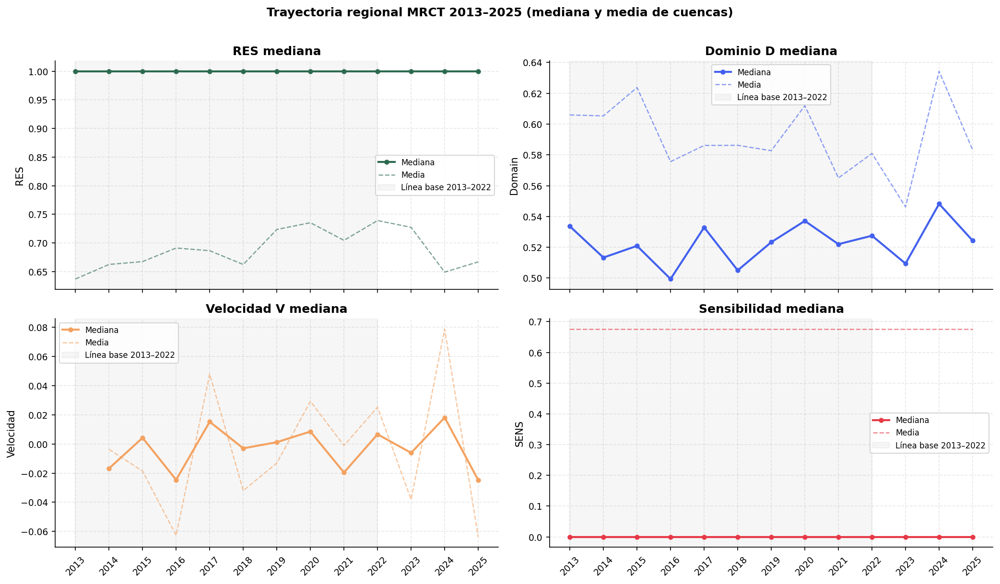
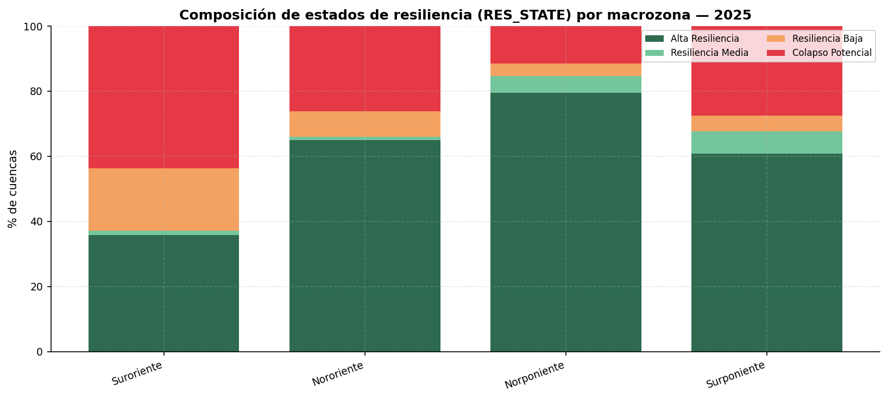
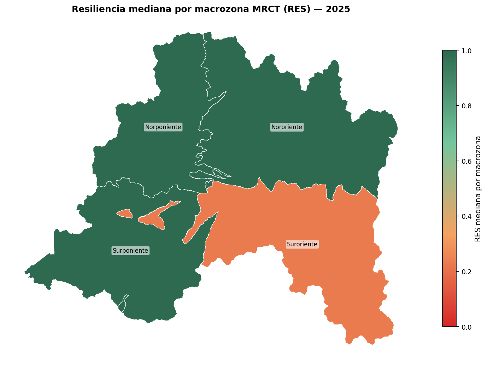
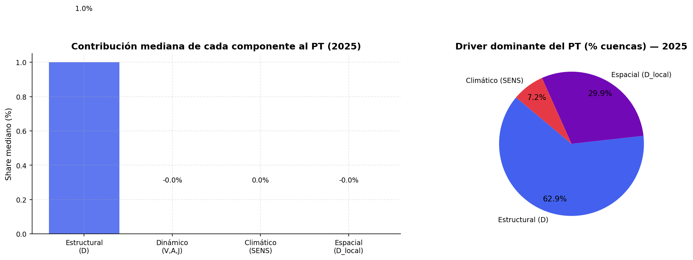
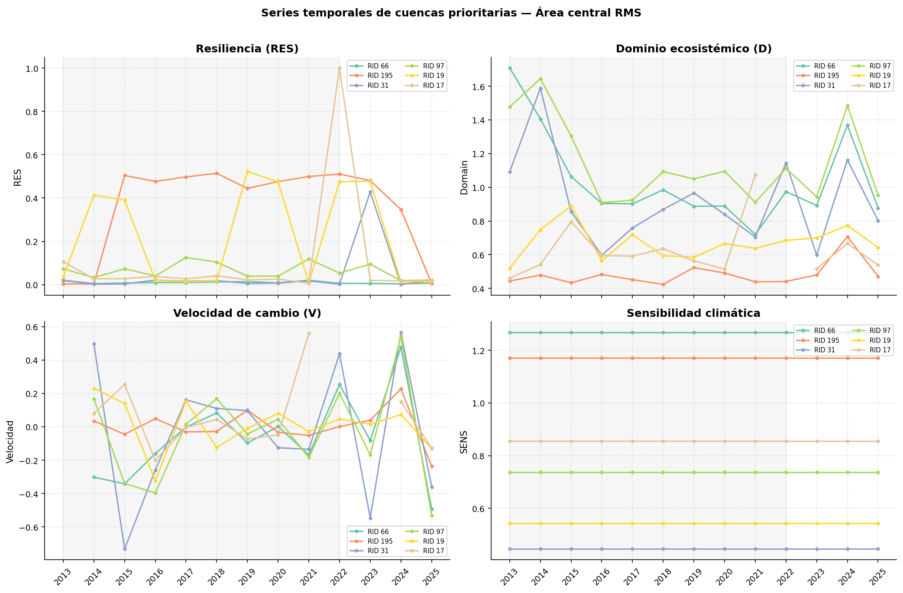
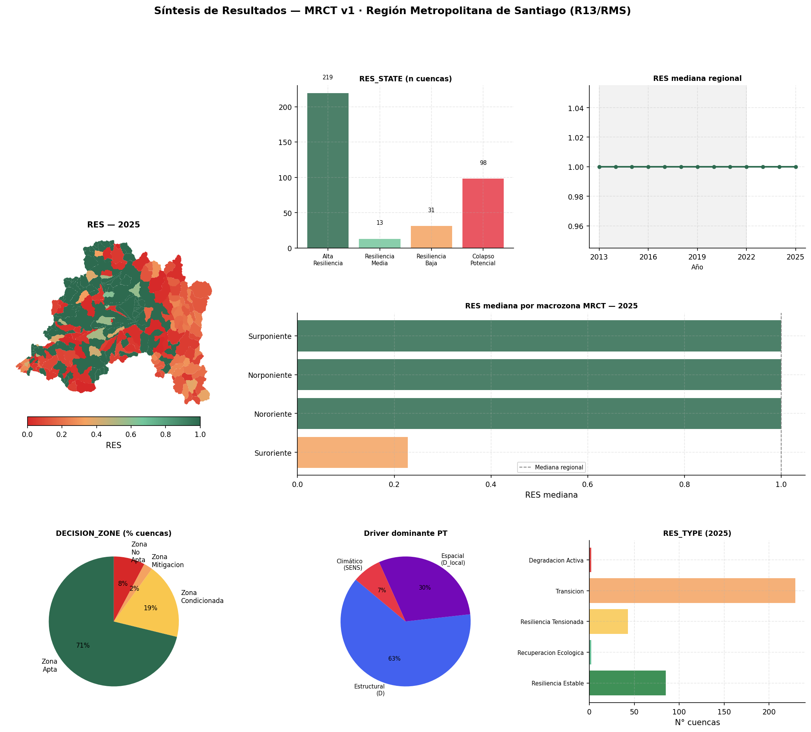

Este capítulo presenta los resultados de la Matriz de Resiliencia Climática Territorial para la Región Metropolitana de Santiago. La lectura se construye a partir del panel temporal consolidado, la capa de cuencas RMS y las salidas cartográficas generadas por el flujo de análisis `MRCT_Analisis_Resultados`.

La estructura sigue el flujo general del libro: primero se revisa la cobertura de datos, luego se describe el comportamiento regional, después se traduce la información a macrozonas MRCT, se descomponen los componentes que explican el resultado final y finalmente se realiza un doble clic sobre el área central metropolitana.

::: {.callout-note}
## Clave de lectura

`RES` resume la resiliencia operativa en escala 0-1. Valores altos indican menor presión de transición; valores bajos indican mayor presión sistémica. Su interpretación debe volver siempre a los componentes que lo generan: distancia estructural $D$, velocidad $V$, sensibilidad climática $SENS$, dominio local $D_{local}$ y Potencial de Transición $PT$.
:::

## Base de resultados y cobertura {#sec-base-resultados}

El panel maestro contiene **4.693 registros**, organizados como **361 cuencas** observadas durante **13 años**, entre **2013 y 2025**. La capa espacial asociada contiene las mismas 361 cuencas y utiliza el sistema de referencia EPSG:32719. Para 2025, el análisis cubre toda la Región Metropolitana de Santiago a partir de una agregación territorial reproducible por macrozonas MRCT.

Los productos RMS disponibles no incluyen una codificación comunal dentro de los polígonos de cuenca. Por esta razón, la lectura territorial usa cuatro macrozonas derivadas de los centroides de las cuencas: **Norponiente**, **Nororiente**, **Surponiente** y **Suroriente**. Esta agregación es analítica y no reemplaza una división administrativa oficial.

La cobertura temporal por cuenca es completa: las 361 cuencas tienen registros para los 13 años del período. Sin embargo, no todas las variables derivadas tienen la misma disponibilidad en 2025, porque algunas dependen de diferencias temporales consecutivas, series válidas o cálculos espaciales que requieren datos suficientes.

| Grupo | Variable | Cobertura 2025 | Lectura |
|---|---|---:|---|
| Indicadores base | VEG, IRV, NP, MPA, PATCH_DENSITY, LPI, CONNECTIVITY, HUM, PN, WA, IA, ALB, TB | 100,0% | Base descriptiva completa para la lectura regional. |
| Indicador con disponibilidad parcial | IEH | 39,3% | Debe interpretarse con cautela en comparaciones finas. |
| Dominio estructural | $D$ | 39,3% | Disponible para 142 cuencas en 2025. |
| Contexto espacial | $D_{local}$ | 34,6% | Disponible para 125 cuencas en 2025. |
| Trayectoria temporal | $V$ | 36,6% | Disponible para 132 cuencas en 2025. |
| Trayectoria temporal | $A$ | 30,7% | Disponible para 111 cuencas en 2025. |
| Trayectoria temporal | $J$ | 28,8% | Disponible para 104 cuencas en 2025. |
| Síntesis MRCT | $SENS$, $PT$, `RES`, `RES_TYPE`, `RES_STATE`, `RES_GRAD`, `DECISION_ZONE`, `TRI`, `ETEI` | 100,0% | Base principal para comunicación y priorización. |

: Cobertura de variables MRCT para el año 2025. {#tbl-cobertura-resultados}

Esta diferencia de cobertura es relevante para la lectura de trayectoria. `RES` y $PT$ están disponibles para toda la región en 2025, pero las derivadas $V$, $A$ y $J$ deben leerse sólo en las cuencas donde la serie temporal permite estimarlas.

## Lectura regional 2025 {#sec-lectura-regional-2025}

En 2025, la Región Metropolitana muestra una distribución polarizada. La mediana regional de `RES` alcanza **1,000**, mientras la media es **0,667**. Esta diferencia indica que existe un conjunto mayoritario de cuencas con resiliencia alta o máxima, junto con un subconjunto crítico de cuencas con `RES` muy bajo.

| Indicador regional 2025 | Valor |
|---|---:|
| Cuencas evaluadas | 361 |
| Mediana regional de `RES` | 1,000 |
| Media regional de `RES` | 0,667 |
| Mediana de $PT$ | 0,000 |
| Media de $PT$ | 24,352 |
| Cuencas en `Alta_Resiliencia` | 60,7% |
| Cuencas en `Colapso_Potencial` | 27,1% |
| Cuencas en `Transicion` | 63,4% |
| Cuencas en `Degradacion_Activa` | 0,6% |
| Cuencas en `Zona_No_Apta` | 7,8% |

: Síntesis regional MRCT para 2025. {#tbl-sintesis-regional-2025}

El Potencial de Transición presenta una distribución altamente asimétrica. La mediana regional es **0,000**, pero el máximo alcanza **4.254,180**. Por esta razón, los mapas y gráficos de $PT$ usan escala logarítmica `log1p(PT)`, mientras que las tablas reportan el valor original.

{#fig-mapa-res-pt-2025 fig-align="center" width="100%"}

La lectura espacial muestra que las cuencas críticas no forman un único bloque homogéneo. El contraste entre zonas de alta resiliencia, cuencas con presión de transición y sectores con bajo `RES` debe leerse junto con las tipologías dinámicas y el contexto espacial.

{#fig-distribucion-res-state-type fig-align="center" width="100%"}

Las cuencas con menor `RES` en 2025 se concentran principalmente en las macrozonas Surponiente, Suroriente y Nororiente. La tabla siguiente muestra los diez casos más extremos ordenados por menor resiliencia operativa.

| Ranking | RID | Macrozona MRCT | `RES` | $PT$ | `RES_TYPE` | $SENS$ | $V$ |
|---:|---:|---|---:|---:|---|---:|---:|
| 1 | 330 | Surponiente | 0,000235 | 4.254,180 | Recuperacion_Ecologica | 1,172 | -0,006 |
| 2 | 202 | Suroriente | 0,001074 | 929,889 | Resiliencia_Estable | 2,360 | -0,016 |
| 3 | 6 | Nororiente | 0,002596 | 384,190 | Resiliencia_Tensionada | 4,395 | 0,042 |
| 4 | 247 | Surponiente | 0,004315 | 230,766 | Transicion | 2,240 | NA |
| 5 | 225 | Surponiente | 0,005008 | 198,666 | Degradacion_Activa | 0,955 | 0,369 |
| 6 | 195 | Suroriente | 0,005389 | 184,554 | Resiliencia_Estable | 1,171 | -0,236 |
| 7 | 204 | Surponiente | 0,007145 | 138,954 | Resiliencia_Tensionada | 2,105 | 0,137 |
| 8 | 66 | Nororiente | 0,007303 | 135,924 | Resiliencia_Estable | 1,267 | -0,492 |
| 9 | 158 | Suroriente | 0,007338 | 135,271 | Transicion | 0,000 | NA |
| 10 | 111 | Norponiente | 0,008835 | 112,188 | Resiliencia_Tensionada | 1,700 | 0,016 |

: Diez cuencas con menor resiliencia operativa en 2025. {#tbl-cuencas-menor-res}

Estos casos no deben leerse sólo como "peores cuencas". Algunos combinan baja resiliencia con señales de recuperación relativa; otros muestran tensión o degradación activa. La diferencia es importante porque una misma condición final puede originarse en trayectorias distintas.

## Trayectoria regional 2013-2025 {#sec-trayectoria-regional-resultados}

La serie regional muestra una trayectoria con resiliencia mediana alta durante todo el período reciente, pero con señales dinámicas localizadas. En 2025, la mediana de `RES` se mantiene en **1,000**, mientras que la mediana de $D$ es **0,524**, la mediana de $V$ es **-0,025** y la mediana de $J$ es **-0,052** en las cuencas con datos disponibles.

| Indicador 2025 | Media | Mediana | Mínimo | P25 | P75 | Máximo |
|---|---:|---:|---:|---:|---:|---:|
| `RES` | 0,667 | 1,000 | 0,000 | 0,172 | 1,000 | 1,000 |
| $PT$ | 24,352 | 0,000 | 0,000 | 0,000 | 4,831 | 4.254,180 |
| $D$ | 0,583 | 0,524 | 0,319 | 0,434 | 0,629 | 4,789 |
| $V$ | -0,064 | -0,025 | -0,819 | -0,095 | 0,011 | 0,369 |
| $A$ | -0,155 | -0,029 | -1,615 | -0,249 | 0,046 | 0,595 |
| $J$ | -0,294 | -0,052 | -2,442 | -0,497 | 0,064 | 1,117 |
| $SENS$ | 0,676 | 0,000 | 0,000 | 0,000 | 1,002 | 11,176 |

: Estadísticas descriptivas regionales de indicadores MRCT para 2025. {#tbl-estadisticas-regionales-2025}

{#fig-trayectoria-regional-resultados fig-align="center" width="100%"}

La estabilidad de la mediana regional no implica ausencia de riesgo. La media de `RES`, la dispersión interna y las cuencas de bajo valor muestran que el problema territorial está concentrado en subconjuntos específicos. Por eso la MRCT debe leerse con mapas, percentiles y tipologías dinámicas, no sólo con promedios regionales.

## Comparación por macrozona MRCT {#sec-comparacion-comunal-resultados}

La agregación por macrozona permite traducir la lectura de cuencas a una escala territorial más comunicable. Esta agregación usa centroides y no límites administrativos, por lo que debe entenderse como una lectura analítica de resultados hidrográficos.

En 2025, la macrozona con menor mediana de `RES` es **Suroriente**, con mediana **0,23** y 43,59% de cuencas en `Colapso_Potencial`. Las otras tres macrozonas tienen mediana igual a **1,00**, pero mantienen subconjuntos críticos internos.

| Macrozona MRCT | Cuencas | `RES` media | `RES` mediana | $PT$ mediana | $D$ mediana | $V$ mediana | $SENS$ mediana | `Colapso_Potencial` | `Alta_Resiliencia` |
|---|---:|---:|---:|---:|---:|---:|---:|---:|---:|
| Suroriente | 78 | 0,45 | 0,23 | 3,39 | 0,49 | -0,03 | 0,89 | 43,59% | 35,90% |
| Nororiente | 103 | 0,70 | 1,00 | 0,00 | 0,54 | -0,17 | 0,00 | 26,21% | 65,05% |
| Surponiente | 102 | 0,67 | 1,00 | 0,00 | 0,59 | 0,00 | 0,00 | 27,45% | 60,78% |
| Norponiente | 78 | 0,84 | 1,00 | 0,00 | 0,46 | 0,01 | 0,00 | 11,54% | 79,49% |

: Comparación por macrozona MRCT de resultados para 2025. {#tbl-comunal-resultados-2025}

{#fig-res-mediana-comunal-resultados fig-align="center" width="100%"}

{#fig-mapa-macrozonas-resultados fig-align="center" width="90%"}

La tabla muestra dos patrones relevantes. Primero, Suroriente concentra la señal territorial más crítica por mediana de resiliencia y porcentaje de colapso potencial. Segundo, las macrozonas con mediana igual a 1,00 no están libres de cuencas críticas: Nororiente y Surponiente tienen más de una cuarta parte de sus cuencas en `Colapso_Potencial`.

## Componentes explicativos {#sec-componentes-explicativos-resultados}

La interpretación de `RES` requiere abrir el resultado final. El $PT$ combina distancia estructural, intensidad de trayectoria, sensibilidad climática y contexto espacial. En 2025, la distribución regional indica que no existe un único componente explicativo para todas las cuencas.

{#fig-drivers-pt-resultados fig-align="center" width="100%"}

La lectura de componentes permite distinguir cuatro situaciones:

- cuencas con bajo `RES` por alejamiento estructural alto, donde $D$ domina la señal;
- cuencas con bajo `RES` por trayectoria activa, donde $V$ amplifica el $PT$;
- cuencas sensibles a forzantes climáticos, donde $SENS$ aumenta la presión de transición;
- cuencas con contraste espacial fuerte, donde $D_{local}$ o `RES_GRAD` muestran una diferencia marcada frente al entorno.

La combinación de estos componentes evita una interpretación excesivamente simple. Dos cuencas pueden tener `RES` bajo, pero una estar en degradación activa, otra en recuperación ecológica y otra en transición sin velocidad disponible para el año más reciente. Por eso la priorización territorial debe considerar simultáneamente `RES_STATE`, `RES_TYPE`, $D$, $V$, $SENS$ y $D_{local}$.

## Doble clic sobre el área central metropolitana {#sec-area-central-resultados}

El área central metropolitana concentra población, infraestructura, servicios regionales y gran parte de las decisiones territoriales de la Región Metropolitana. En la MRCT 2025, el subconjunto de 50 km alrededor del centro de Santiago incluye **193 cuencas**, con una superficie total aproximada de **7.898,4 km²** y **2.509 registros** en el período 2013-2025.

La mediana del área central de `RES` es **1,000**, superior a la media regional. Sin embargo, esta cifra esconde contrastes internos: **144 cuencas** están en `Alta_Resiliencia`, mientras **35 cuencas** aparecen en `Colapso_Potencial`. La zona central no debe leerse como un promedio homogéneo, sino como un territorio donde coexisten cuencas muy resilientes con focos críticos de baja resiliencia.

| Indicador área central RMS 2025 | Valor |
|---|---:|
| Cuencas evaluadas | 193 |
| Superficie total aproximada | 7.898,4 km² |
| `RES` media | 0,787 |
| `RES` mediana | 1,000 |
| Cuencas en `Alta_Resiliencia` | 144 |
| Cuencas en `Colapso_Potencial` | 35 |
| Cuencas en `Resiliencia_Baja` | 5 |
| Cuencas en `Resiliencia_Media` | 9 |
| Cuencas en `Transicion` | 150 |
| Cuencas en `Resiliencia_Estable` | 25 |
| Cuencas en `Zona_Apta` | 161 |
| Cuencas en `Zona_No_Apta` | 8 |

: Perfil del área central metropolitana en 2025. {#tbl-area-central-perfil}

{#fig-area-central-mapas-resultados fig-align="center" width="100%"}

El ranking interno de cuencas prioritarias del área central fue construido combinando $PT$, bajo `RES` y velocidad alta. La mayoría de los casos priorizados se ubica en `Colapso_Potencial`, pero difieren en zona de decisión, tipo de resiliencia y trayectoria.

| Prioridad | RID | `RES` | $PT$ | $D$ | $V$ | $SENS$ | $D_{local}$ | `RES_TYPE` | Zona |
|---:|---:|---:|---:|---:|---:|---:|---:|---|---|
| 1 | 66 | 0,0073 | 135,9236 | 0,8769 | -0,4920 | 1,2673 | 89,6399 | Resiliencia_Estable | Zona_Mitigacion |
| 2 | 195 | 0,0054 | 184,5536 | 0,4710 | -0,2361 | 1,1708 | 290,0875 | Resiliencia_Estable | Zona_Mitigacion |
| 3 | 31 | 0,0174 | 56,6367 | 0,8026 | -0,3594 | 0,4459 | 69,8067 | Resiliencia_Estable | Zona_Condicionada |
| 4 | 97 | 0,0221 | 44,3444 | 0,9530 | -0,5317 | 0,7372 | 32,9756 | Resiliencia_Estable | Zona_Condicionada |
| 5 | 19 | 0,0145 | 67,9749 | 0,6430 | -0,1303 | 0,5427 | 119,2632 | Resiliencia_Estable | Zona_Condicionada |
| 6 | 17 | 0,0199 | 49,2043 | 0,5383 | -0,1281 | 0,8546 | 85,3675 | Resiliencia_Estable | Zona_Apta |
| 7 | 22 | 0,0260 | 37,4050 | 0,6311 | 0,2092 | 0,3829 | 68,8951 | Resiliencia_Tensionada | Zona_Apta |
| 8 | 117 | 0,0488 | 19,4872 | 0,5767 | -0,2517 | 1,5859 | 18,8782 | Resiliencia_Estable | Zona_Condicionada |
| 9 | 353 | 0,0175 | 56,1498 | 0,5308 | 0,0452 | 1,0852 | 95,0705 | Resiliencia_Tensionada | Zona_Condicionada |
| 10 | 90 | 0,1683 | 4,9412 | 0,5363 | -0,4417 | 1,7948 | 2,5731 | Resiliencia_Estable | Zona_Condicionada |

: Diez cuencas prioritarias del área central RMS según score crítico 2025. {#tbl-area-central-prioritarias}

{#fig-area-central-series-resultados fig-align="center" width="100%"}

La tabla muestra que no todas las cuencas críticas tienen la misma trayectoria. Algunas están clasificadas como `Resiliencia_Tensionada`, con velocidad positiva y alejamiento del dominio. Otras aparecen como `Resiliencia_Estable`, con velocidad negativa, lo que sugiere recuperación relativa aunque mantengan baja resiliencia operativa. Este contraste es clave para validación territorial: la revisión no debe buscar sólo deterioro, sino también casos donde la matriz detecta recuperación o reversión.

## Síntesis de hallazgos {#sec-sintesis-resultados}

Los resultados de 2025 permiten ordenar cinco hallazgos principales.

Primero, la región presenta una distribución polarizada. La mediana de `RES` es alta, pero un 27,1% de las cuencas aparece en `Colapso_Potencial`. Esto obliga a leer el territorio con percentiles, mapas y tipologías, no sólo con promedios.

Segundo, el $PT$ es altamente asimétrico. La mediana regional es 0,000, pero un grupo pequeño de cuencas concentra valores extremos, por lo que la escala logarítmica es necesaria para visualización y las decisiones deben revisar los valores originales.

Tercero, la comparación por macrozona distingue una señal crítica clara en Suroriente, que combina menor mediana de resiliencia y mayor proporción relativa de colapso potencial. Nororiente y Surponiente también requieren atención porque, pese a tener mediana alta, contienen subconjuntos críticos.

Cuarto, el área central RMS requiere una lectura interna. Su mediana de resiliencia es alta, pero 35 cuencas aparecen en `Colapso_Potencial` y 8 quedan en `Zona_No_Apta`. La selección de cuencas prioritarias muestra casos de baja resiliencia con distintas trayectorias y zonas de decisión.

Quinto, la MRCT funciona mejor como sistema de preguntas que como sentencia única. Los resultados permiten priorizar dónde mirar, qué cuencas revisar, qué trayectorias contrastar y qué hipótesis llevar a validación territorial.

{#fig-sintesis-resultados-mrct fig-align="center" width="100%"}

## Preguntas para validación territorial {#sec-preguntas-validacion-resultados}

A partir de estos resultados, se proponen cinco preguntas para trabajo posterior:

- ¿las cuencas en `Colapso_Potencial` coinciden con áreas de alta presión antrópica urbana, periurbana o cordillerana?;
- ¿los años con mayor jerk corresponden a eventos climáticos, hidrológicos o de cobertura documentados en la Región Metropolitana?;
- ¿las cuencas prioritarias del área central RMS son urbanas, periurbanas o rurales, y qué tan factible es visitarlas?;
- ¿la sensibilidad climática $SENS$ refleja gradientes regionales de aridez, albedo, nieve o temperatura de brillo?;
- ¿los gradientes de `RES_GRAD` identifican discontinuidades espaciales que puedan validarse con observación territorial?

## Notas metodológicas {#sec-notas-resultados}

La MRCT opera sobre cuencas hidrográficas, no sobre límites administrativos. En esta versión RMS, la agregación territorial usa macrozonas MRCT derivadas desde centroides de cuenca, debido a que los productos disponibles no incluyen `CUT_COM`. Esta división es reproducible, pero no debe interpretarse como equivalente a comunas, provincias o áreas funcionales oficiales.

El $PT$ tiene una distribución muy asimétrica. Para visualizaciones se usa `log1p(PT)`, pero las tablas mantienen los valores originales. Las cuencas con $PT = 0$ corresponden a casos donde $D$, $V$, $SENS$ y $D_{local}$ no amplifican presión de transición bajo la configuración del modelo.

La línea base del dominio corresponde al período **2013-2022**. Los años **2023-2025** son años de evaluación posterior respecto de esa referencia. Un aumento de $D$ indica alejamiento del régimen de referencia, pero no prueba por sí solo causalidad ecológica.
