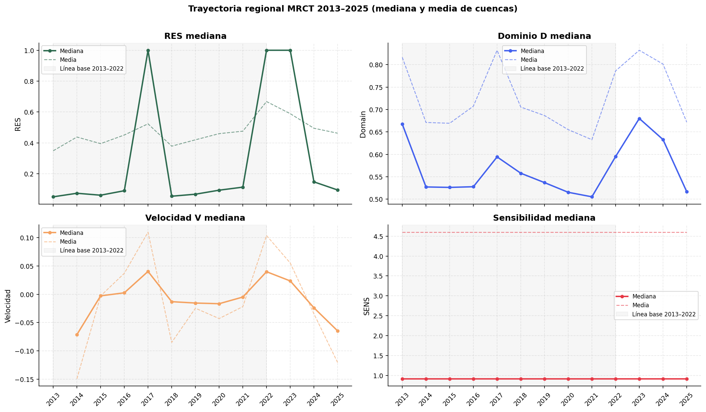
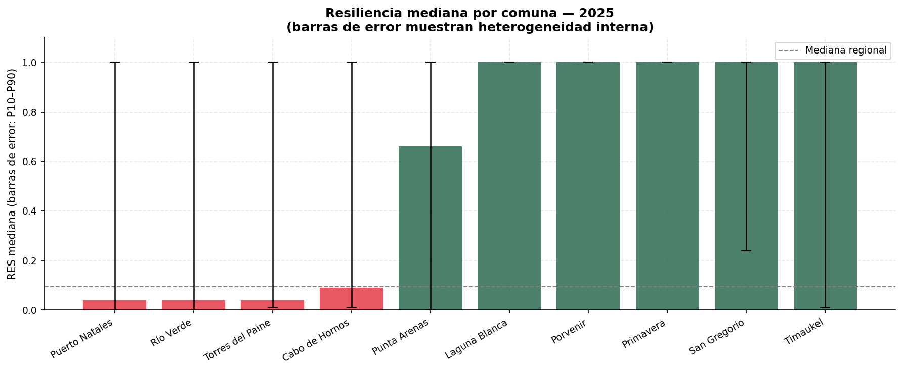
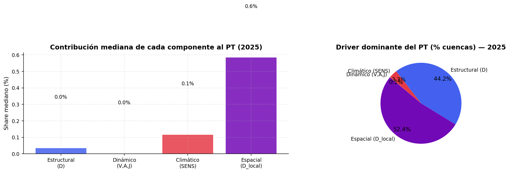
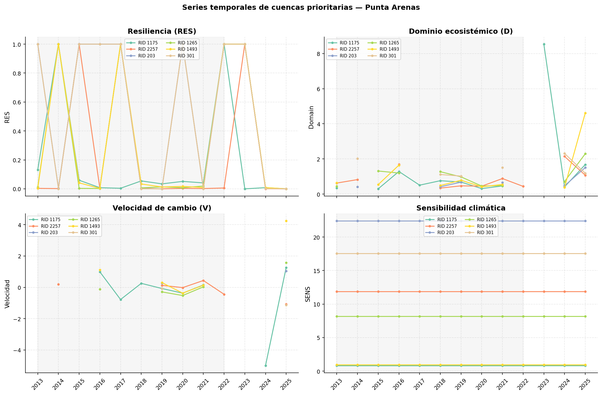
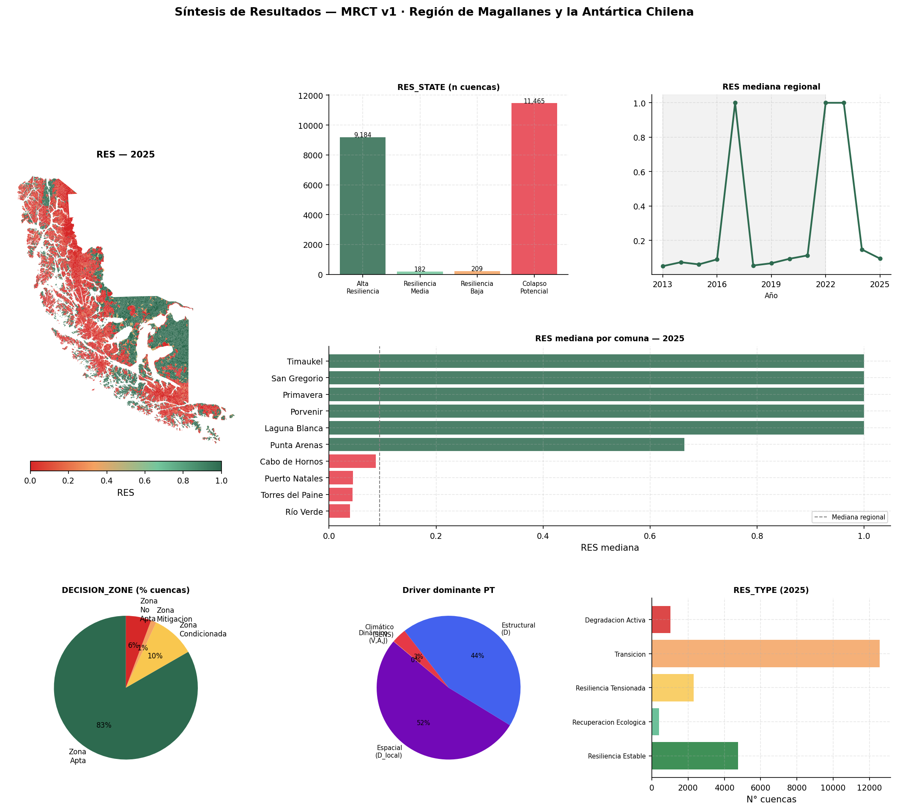

Este capítulo presenta los resultados de la Matriz de Resiliencia Climática Territorial para la Región de Magallanes y de la Antártica Chilena. La lectura se construye a partir del panel temporal consolidado, las tablas de síntesis comunal y las salidas cartográficas generadas para el análisis territorial.

La estructura sigue el flujo general de análisis definido para el libro: primero se revisa la cobertura de datos, luego se describe el comportamiento regional, después se traduce la información a escala comunal, se descomponen los componentes que explican el resultado final y finalmente se realiza un doble clic sobre Punta Arenas.

::: {.callout-note}
## Clave de lectura

`RES` resume la resiliencia operativa en escala 0-1. Valores altos indican menor presión de transición; valores bajos indican mayor presión sistémica. Su interpretación debe volver siempre a los componentes que lo generan: distancia estructural $D$, velocidad $V$, sensibilidad climática $SENS$, dominio local $D_{local}$ y Potencial de Transición $PT$.
:::

## Base de resultados y cobertura {#sec-base-resultados}

El panel maestro contiene **273.520 registros**, organizados como **21.040 cuencas** observadas durante **13 años**, entre **2013 y 2025**. La capa espacial asociada contiene las mismas 21.040 cuencas y utiliza el sistema de referencia EPSG:32719. Para 2025, el análisis cubre diez comunas: Punta Arenas, Laguna Blanca, Río Verde, San Gregorio, Cabo de Hornos, Porvenir, Primavera, Timaukel, Puerto Natales y Torres del Paine.

La cobertura temporal por cuenca es completa: las 21.040 cuencas tienen registros para los 13 años del período. Sin embargo, no todas las variables derivadas tienen la misma disponibilidad en 2025, porque algunas dependen de diferencias temporales consecutivas, series válidas o cálculos espaciales que requieren datos suficientes.

| Grupo | Variable | Cobertura 2025 | Lectura |
|---|---|---:|---|
| Indicadores base | VEG, IRV, NP, MPA, PATCH_DENSITY, LPI, CONNECTIVITY, HUM, PN, WA, IA, ALB, TB | 100,0% | Base descriptiva completa para la lectura regional. |
| Indicador con disponibilidad parcial | IEH | 56,4% | Debe interpretarse con cautela en comparaciones finas. |
| Dominio estructural | $D$ | 56,4% | Disponible para 11.858 cuencas en 2025. |
| Contexto espacial | $D_{local}$ | 54,6% | Disponible para 11.495 cuencas en 2025. |
| Trayectoria temporal | $V$ | 40,3% | Disponible para 8.483 cuencas en 2025. |
| Trayectoria temporal | $A$ | 27,4% | Disponible para 5.761 cuencas en 2025. |
| Trayectoria temporal | $J$ | 17,9% | Disponible para 3.770 cuencas en 2025. |
| Síntesis MRCT | $SENS$, $PT$, `RES`, `RES_TYPE`, `RES_STATE`, `RES_GRAD`, `DECISION_ZONE`, `TRI`, `ETEI` | 100,0% | Base principal para comunicación y priorización. |

: Cobertura de variables MRCT para el año 2025. {#tbl-cobertura-resultados}

Esta diferencia de cobertura es relevante para la lectura de trayectoria. `RES` y $PT$ están disponibles para toda la región en 2025, pero las derivadas $V$, $A$ y $J$ deben leerse sólo en las cuencas donde la serie temporal permite estimarlas.

## Lectura regional 2025 {#sec-lectura-regional-2025}

En 2025, la región muestra una distribución muy polarizada de resiliencia operativa. La mediana regional de `RES` es **0,094**, mientras la media alcanza **0,462**. Esta diferencia indica que existe un grupo amplio de cuencas con valores bajos y, al mismo tiempo, un conjunto importante de cuencas con resiliencia alta o máxima.

| Indicador regional 2025 | Valor |
|---|---:|
| Cuencas evaluadas | 21.040 |
| Mediana regional de `RES` | 0,094 |
| Media regional de `RES` | 0,462 |
| Mediana de $PT$ | 9,622 |
| Media de $PT$ | 290,975 |
| Cuencas en `Alta_Resiliencia` | 43,7% |
| Cuencas en `Colapso_Potencial` | 54,5% |
| Cuencas en `Transicion` | 59,7% |
| Cuencas en `Degradacion_Activa` | 4,8% |
| Cuencas en `Zona_No_Apta` | 5,7% |

: Síntesis regional MRCT para 2025. {#tbl-sintesis-regional-2025}

El Potencial de Transición presenta una distribución altamente asimétrica. Su mediana regional es **9,622**, pero el valor máximo supera **1.508.000**. Por esta razón, los mapas y gráficos de $PT$ usan escala logarítmica `log1p(PT)`, mientras que las tablas reportan el valor original.

{#fig-mapa-res-pt-2025 fig-align="center" width="100%"}

La lectura espacial muestra que las cuencas con menor resiliencia no deben interpretarse como un único bloque homogéneo. Hay zonas con alta presión de transición, cuencas con comportamiento extremo y áreas con resiliencia alta que permanecen cercanas al estado de referencia. La combinación entre mapa, distribución de estados y tipologías dinámicas permite separar nivel, trayectoria y contexto.

{#fig-distribucion-res-state-type fig-align="center" width="100%"}

Las cuencas con menor `RES` en 2025 se concentran principalmente en Cabo de Hornos, Timaukel, Puerto Natales, Río Verde y algunos casos de Punta Arenas. La tabla siguiente muestra los diez casos más extremos ordenados por menor resiliencia operativa.

| Ranking | RID | Comuna | `RES` | $PT$ | `RES_TYPE` | $SENS$ | $V$ |
|---:|---:|---|---:|---:|---|---:|---:|
| 1 | 6067 | Cabo de Hornos | 0,000001 | 1.508.758 | Degradacion_Activa | 8,27 | 5,00 |
| 2 | 10256 | Timaukel | 0,000002 | 555.227 | Transicion | 8,17 | NA |
| 3 | 14352 | Puerto Natales | 0,000002 | 496.299 | Degradacion_Activa | 1,87 | 5,00 |
| 4 | 6059 | Cabo de Hornos | 0,000004 | 235.544 | Degradacion_Activa | 1,07 | 3,83 |
| 5 | 6646 | Cabo de Hornos | 0,000007 | 152.989 | Transicion | 38,35 | NA |
| 6 | 6076 | Cabo de Hornos | 0,000007 | 149.191 | Transicion | 3,21 | NA |
| 7 | 6090 | Cabo de Hornos | 0,000009 | 113.288 | Degradacion_Activa | 26,26 | 0,78 |
| 8 | 10329 | Timaukel | 0,000014 | 73.318 | Transicion | 1,97 | NA |
| 9 | 4638 | Río Verde | 0,000014 | 69.173 | Transicion | 347,29 | NA |
| 10 | 6055 | Cabo de Hornos | 0,000018 | 56.113 | Degradacion_Activa | 5,69 | 0,65 |

: Diez cuencas con menor resiliencia operativa en 2025. {#tbl-cuencas-menor-res}

Estos casos no deben leerse sólo como "peores cuencas". Algunos combinan baja resiliencia con degradación activa; otros aparecen en transición sin velocidad disponible para 2025. La diferencia es importante, porque una misma condición final puede originarse en trayectorias distintas.

## Trayectoria regional 2013-2025 {#sec-trayectoria-regional-resultados}

La serie regional muestra cambios marcados entre la línea base y los años recientes. La mediana de `RES` alcanza valores altos en 2017, 2022 y 2023, pero cae en 2024 y vuelve a descender en 2025 hasta **0,094**. En paralelo, la mediana de $D$ se reduce desde **0,633** en 2024 a **0,517** en 2025, mientras la velocidad mediana de 2025 es **-0,065**.

| Año | `RES` mediana | `RES` media | $D$ mediana | $D$ media | $V$ mediana | $V$ media |
|---:|---:|---:|---:|---:|---:|---:|
| 2021 | 0,113 | 0,475 | 0,505 | 0,633 | -0,005 | -0,022 |
| 2022 | 1,000 | 0,667 | 0,595 | 0,786 | 0,040 | 0,104 |
| 2023 | 1,000 | 0,589 | 0,680 | 0,832 | 0,024 | 0,055 |
| 2024 | 0,147 | 0,494 | 0,633 | 0,801 | -0,024 | -0,035 |
| 2025 | 0,094 | 0,462 | 0,517 | 0,672 | -0,065 | -0,121 |

: Trayectoria regional reciente de indicadores MRCT. {#tbl-trayectoria-regional}

{#fig-trayectoria-regional-resultados fig-align="center" width="100%"}

La caída de `RES` en 2025 no debe interpretarse automáticamente como deterioro lineal de toda la región. La media y la mediana se comportan de forma distinta, y la distribución es muy asimétrica. Esto confirma que la MRCT debe leerse con mapas, percentiles y tipologías dinámicas, no sólo con promedios regionales.

## Comparación comunal {#sec-comparacion-comunal-resultados}

La agregación comunal permite traducir la lectura de cuencas a una escala de gestión pública. Esta agregación usa la asignación comunal disponible en la capa espacial, por lo que debe entenderse como una lectura administrativa de resultados hidrográficos.

En 2025, las comunas con menor mediana de `RES` son Río Verde, Torres del Paine y Puerto Natales, todas con medianas cercanas a **0,04**. Cabo de Hornos también muestra una mediana baja (**0,09**), aunque con una proporción mayor de cuencas en alta resiliencia que las tres anteriores. Punta Arenas ocupa una posición intermedia: mediana **0,66**, pero con una heterogeneidad interna fuerte.

| Comuna | Cuencas | `RES` media | `RES` mediana | $PT$ mediana | $D$ mediana | $V$ mediana | $SENS$ mediana | `Colapso_Potencial` | `Alta_Resiliencia` |
|---|---:|---:|---:|---:|---:|---:|---:|---:|---:|
| Puerto Natales | 8.574 | 0,32 | 0,04 | 21,33 | 0,49 | -0,17 | 1,13 | 69,28% | 29,48% |
| Río Verde | 1.405 | 0,31 | 0,04 | 24,75 | 0,55 | 0,02 | 1,01 | 70,53% | 27,54% |
| Torres del Paine | 795 | 0,30 | 0,04 | 21,67 | 0,81 | 0,03 | 0,72 | 71,82% | 26,04% |
| Cabo de Hornos | 2.791 | 0,45 | 0,09 | 10,50 | 0,52 | -0,04 | 1,18 | 55,75% | 42,10% |
| Punta Arenas | 3.072 | 0,52 | 0,66 | 0,52 | 0,56 | 0,03 | 1,29 | 47,72% | 50,00% |
| Laguna Blanca | 434 | 0,93 | 1,00 | 0,00 | 1,01 | 0,06 | 0,00 | 5,99% | 91,71% |
| Porvenir | 959 | 0,92 | 1,00 | 0,00 | 0,66 | 0,01 | 0,00 | 6,78% | 91,24% |
| Primavera | 575 | 0,92 | 1,00 | 0,00 | 0,59 | 0,02 | 0,00 | 6,96% | 90,43% |
| San Gregorio | 876 | 0,89 | 1,00 | 0,00 | 0,72 | 0,03 | 0,00 | 9,59% | 87,67% |
| Timaukel | 1.559 | 0,54 | 1,00 | 0,00 | 0,55 | -0,02 | 0,74 | 46,57% | 50,67% |

: Comparación comunal de resultados MRCT para 2025. {#tbl-comunal-resultados-2025}

{#fig-res-mediana-comunal-resultados fig-align="center" width="100%"}

La tabla muestra dos patrones relevantes. Primero, Puerto Natales concentra el mayor número de cuencas evaluadas, con 8.574 unidades, lo que exige interpretar sus promedios junto con percentiles y mapas. Segundo, varias comunas tienen mediana igual a 1,00, pero no por eso carecen de cuencas críticas: Timaukel, por ejemplo, combina mediana alta con **46,57%** de cuencas en `Colapso_Potencial`, lo que revela una distribución interna fuertemente polarizada.

## Componentes explicativos {#sec-componentes-explicativos-resultados}

La interpretación de `RES` requiere abrir el resultado final. El $PT$ combina distancia estructural, intensidad de trayectoria, sensibilidad climática y contexto espacial. En 2025, la distribución regional indica que no existe un único componente explicativo para todas las cuencas.

{#fig-drivers-pt-resultados fig-align="center" width="100%"}

La lectura de componentes permite distinguir cuatro situaciones:

- cuencas con bajo `RES` por alejamiento estructural alto, donde $D$ domina la señal;
- cuencas con bajo `RES` por trayectoria activa, donde $V$ amplifica el $PT$;
- cuencas sensibles a forzantes climáticos, donde $SENS$ aumenta la presión de transición;
- cuencas con contraste espacial fuerte, donde $D_{local}$ o `RES_GRAD` muestran una diferencia marcada frente al entorno.

La combinación de estos componentes evita una interpretación excesivamente simple. Dos cuencas pueden tener `RES` bajo, pero una estar en degradación activa, otra en recuperación ecológica y otra en transición sin velocidad disponible para el año más reciente. Por eso la priorización territorial debe considerar simultáneamente `RES_STATE`, `RES_TYPE`, $D$, $V$, $SENS$ y $D_{local}$.

## Doble clic sobre Punta Arenas {#sec-punta-arenas-resultados}

Punta Arenas concentra población, infraestructura, servicios regionales y una parte importante de las decisiones territoriales de Magallanes. En la MRCT 2025, la comuna incluye **3.072 cuencas**, con una superficie total aproximada de **17.402,9 km²** y **39.936 registros** en el período 2013-2025.

La mediana comunal de `RES` es **0,664**, superior a la mediana regional. Sin embargo, esta cifra esconde una división interna fuerte: **1.536 cuencas** están en `Alta_Resiliencia`, mientras **1.466 cuencas** aparecen en `Colapso_Potencial`. Es decir, Punta Arenas no debe leerse como un promedio comunal homogéneo, sino como un territorio con contrastes internos relevantes.

| Indicador Punta Arenas 2025 | Valor |
|---|---:|
| Cuencas evaluadas | 3.072 |
| Superficie total aproximada | 17.402,9 km² |
| `RES` media | 0,520 |
| `RES` mediana | 0,664 |
| Cuencas en `Alta_Resiliencia` | 1.536 |
| Cuencas en `Colapso_Potencial` | 1.466 |
| Cuencas en `Resiliencia_Baja` | 35 |
| Cuencas en `Resiliencia_Media` | 35 |
| Cuencas en `Transicion` | 2.109 |
| Cuencas en `Degradacion_Activa` | 194 |
| Cuencas en `Zona_Apta` | 2.974 |
| Cuencas en `Zona_No_Apta` | 30 |

: Perfil comunal de Punta Arenas en 2025. {#tbl-punta-arenas-perfil}

{#fig-punta-arenas-mapas-resultados fig-align="center" width="100%"}

El ranking interno de cuencas prioritarias de Punta Arenas fue construido combinando $PT$, bajo `RES` y velocidad alta. La mayoría de los casos priorizados están en `Zona_Apta`, lo que los vuelve especialmente útiles para validación territorial porque combinan señal crítica y factibilidad de revisión.

| Prioridad | RID | `RES` | $PT$ | $D$ | $V$ | $SENS$ | $D_{local}$ | `RES_TYPE` | Zona |
|---:|---:|---:|---:|---:|---:|---:|---:|---|---|
| 1 | 1175 | 0,0002 | 5.743,09 | 1,68 | 1,27 | 0,82 | 1.656,77 | Degradacion_Activa | Zona_Apta |
| 2 | 2257 | 0,0000 | 27.953,16 | 1,08 | -1,07 | 11,86 | 1.950,39 | Recuperacion_Ecologica | Zona_Apta |
| 3 | 203 | 0,0001 | 15.552,58 | 1,51 | 1,03 | 22,40 | 430,90 | Degradacion_Activa | Zona_Apta |
| 4 | 1265 | 0,0004 | 2.317,18 | 2,29 | 1,58 | 8,19 | 83,13 | Degradacion_Activa | Zona_Apta |
| 5 | 1493 | 0,0005 | 2.047,66 | 4,62 | 4,23 | 0,97 | 83,91 | Degradacion_Activa | Zona_Apta |
| 6 | 301 | 0,0002 | 4.077,71 | 1,19 | -1,12 | 17,57 | 171,69 | Recuperacion_Ecologica | Zona_Apta |
| 7 | 2265 | 0,0005 | 2.205,63 | 1,32 | -1,29 | 7,82 | 163,12 | Recuperacion_Ecologica | Zona_Apta |
| 8 | 255 | 0,0003 | 3.978,27 | 0,50 | -1,10 | 12,58 | 552,98 | Resiliencia_Estable | Zona_Apta |
| 9 | 452 | 0,0005 | 2.164,00 | 1,63 | 1,23 | 10,87 | 98,45 | Degradacion_Activa | Zona_Apta |
| 10 | 250 | 0,0004 | 2.772,57 | 1,70 | 1,13 | 3,52 | 337,98 | Degradacion_Activa | Zona_Apta |

: Diez cuencas prioritarias de Punta Arenas según score crítico 2025. {#tbl-punta-arenas-prioritarias}

{#fig-punta-arenas-series-resultados fig-align="center" width="100%"}

La tabla muestra que no todas las cuencas críticas tienen la misma trayectoria. Algunas están clasificadas como `Degradacion_Activa`, con velocidad positiva y alejamiento del dominio. Otras aparecen como `Recuperacion_Ecologica`, con velocidad negativa, lo que sugiere retorno relativo aunque mantengan baja resiliencia operativa. Este contraste es clave para terreno: la validación no debe buscar sólo deterioro, sino también casos donde la matriz detecta recuperación o reversión.

## Síntesis de hallazgos {#sec-sintesis-resultados}

Los resultados de 2025 permiten ordenar cinco hallazgos principales.

Primero, la región presenta una distribución polarizada. La mediana de `RES` es baja, pero existe una proporción relevante de cuencas con alta resiliencia. Esto obliga a leer el territorio con percentiles, mapas y tipologías, no sólo con promedios.

Segundo, el $PT$ es altamente asimétrico. Un grupo pequeño de cuencas concentra valores extremos, por lo que la escala logarítmica es necesaria para visualización, pero las decisiones deben revisar los valores originales.

Tercero, la comparación comunal distingue tres grupos: comunas con baja mediana de resiliencia, como Río Verde, Torres del Paine y Puerto Natales; comunas con resiliencia alta dominante, como Laguna Blanca, Porvenir, Primavera y San Gregorio; y comunas polarizadas, como Punta Arenas y Timaukel.

Cuarto, Punta Arenas requiere una lectura interna. Su mediana comunal es relativamente alta, pero casi la mitad de sus cuencas aparece en `Colapso_Potencial`. La selección de cuencas prioritarias muestra casos tanto de degradación activa como de recuperación ecológica.

Quinto, la MRCT funciona mejor como sistema de preguntas que como sentencia única. Los resultados permiten priorizar dónde mirar, qué cuencas revisar, qué trayectorias contrastar y qué hipótesis llevar a validación territorial.

{#fig-sintesis-resultados-mrct fig-align="center" width="100%"}

## Preguntas para validación territorial {#sec-preguntas-validacion-resultados}

A partir de estos resultados, se proponen cinco preguntas para trabajo posterior:

- ¿las cuencas en `Colapso_Potencial` coinciden con áreas de alta presión antrópica o con condiciones ecosistémicas particulares?;
- ¿los años con mayor jerk corresponden a eventos climáticos, hidrológicos o de cobertura documentados?;
- ¿las cuencas prioritarias de Punta Arenas son urbanas, periurbanas o rurales, y qué tan factible es visitarlas?;
- ¿la sensibilidad climática $SENS$ refleja gradientes regionales de aridez, albedo o temperatura de brillo?;
- ¿los gradientes de `RES_GRAD` identifican discontinuidades espaciales que puedan validarse con observación de terreno?

## Notas metodológicas {#sec-notas-resultados}

La MRCT opera sobre cuencas hidrográficas, no sobre límites administrativos. La agregación comunal usa la asignación `CUT_COM` disponible en la capa espacial, por lo que las comunas con muchas cuencas pequeñas pueden mostrar mayor varianza interna que comunas con pocas cuencas grandes.

El $PT$ tiene una distribución muy asimétrica. Para visualizaciones se usa `log1p(PT)`, pero las tablas mantienen los valores originales. Las cuencas con $PT = 0$ corresponden a casos donde $D$, $V$, $SENS$ y $D_{local}$ no amplifican presión de transición bajo la configuración del modelo.

La línea base del dominio corresponde al período **2013-2022**. Los años **2023-2025** son años de evaluación posterior respecto de esa referencia. Un aumento de $D$ indica alejamiento del régimen de referencia, pero no prueba por sí solo causalidad ecológica.

Finalmente, `RES_STATE` indica nivel de resiliencia operativa, mientras `RES_TYPE`, $V$, $A$ y $J$ ayudan a leer trayectoria. La interpretación territorial debe integrar ambas dimensiones antes de definir prioridades de monitoreo, validación o gestión.
