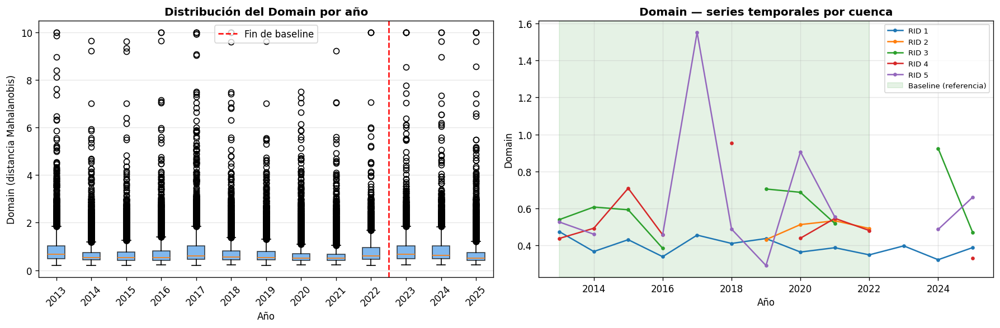

Una vez calculados los 14 indicadores base para cada cuenca y cada año, el siguiente paso es integrarlos en una estructura única que permita operar sobre el sistema completo. Esa estructura es el vector de estado ecosistémico.

Este capítulo describe cómo se organiza la información en un hipercubo de datos, cómo se transforma en un panel longitudinal, qué período define la línea base del sistema y cómo se construye el dominio de referencia a partir del cual se medirán las distancias.

## Hipercubo y panel {#sec-hipercubo}

Los indicadores base se almacenan en un tensor tridimensional de la forma:

$$\mathbf{T} \in \mathbb{R}^{N \times Y \times d}$$

donde $N$ es el número de cuencas hidrográficas, $Y$ es el número de años disponibles (2013–2025) y $d = 14$ es la dimensión del vector de indicadores. Cada celda $\mathbf{T}[i, t, k]$ contiene el valor del indicador $k$ en la cuenca $i$ durante el año $t$. Las celdas correspondientes a años sin mosaico válido se registran como no disponibles ($\text{NaN}$).

Esta estructura tridimensional es útil para el almacenamiento, pero la mayor parte del procesamiento estadístico requiere una tabla bidimensional. El hipercubo se transforma en un **panel largo** con una fila por combinación cuenca × año:

| RID | Year | VEG | IRV | NP | $\cdots$ | TB |
|-----|------|-----|-----|----|----------|----|
| 101 | 2013 | 0.41 | 0.31 | 12 | $\cdots$ | 8.2 |
| 101 | 2014 | 0.38 | 0.29 | 11 | $\cdots$ | 9.1 |
| $\vdots$ | $\vdots$ | $\vdots$ | $\vdots$ | $\vdots$ | $\ddots$ | $\vdots$ |

El panel incluye todas las combinaciones posibles del producto cartesiano $\{RID\} \times \{años\}$, aunque algunos años no tengan observación válida. Esto garantiza que la estructura temporal sea completa y que las operaciones de diferenciación y agregación operen sobre una grilla regular.

## Línea base {#sec-baseline}

La línea base define el **estado de referencia** del sistema. No representa un estado ideal ni una condición óptima: es el régimen ecosistémico observado durante un período de relativa estabilidad climática, respecto del cual se medirán las trayectorias posteriores.

El período de referencia por defecto comprende los años **2013–2022** (diez años). Esta ventana fue seleccionada porque cubre el primer ciclo completo de observaciones disponibles con Landsat 8 y precede a los episodios de mayor variabilidad reciente.

No todos los indicadores participan en la construcción del dominio de referencia. El modelo distingue entre **variables estructurales** —aquellas que describen el estado del ecosistema natural— y variables de carácter energético o antrópico que se incorporan en etapas posteriores. Las variables estructurales que componen la línea base son:

$$\mathcal{V}_{struct} = \{\text{VEG},\; \text{IRV},\; \text{NP},\; \text{MPA},\; \text{PATCH\_DENSITY},\; \text{LPI},\; \text{CONNECTIVITY},\; \text{IEH},\; \text{HUM},\; \text{PN},\; \text{WA}\}$$

Las variables IA, ALB y TB quedan fuera de esta selección: representan señales de energía y aridez que entran en el modelo en la etapa de sensibilidad climática, no en la definición del dominio estructural.

Antes de usar las variables en la línea base, se aplica un criterio de estabilidad: se retienen únicamente aquellas con varianza suficiente (desviación estándar $> 10^{-6}$) y con al menos 10 observaciones finitas durante el período de referencia. Este filtro evita que variables sin información real distorsionen la estimación del dominio.

::: {.callout-note}
## En términos simples

La línea base responde a la pregunta: ¿cómo eran estas cuencas durante el período de referencia? A partir de esa respuesta, el modelo puede medir cuánto se alejó el sistema en los años siguientes.
:::

## Dominio de referencia {#sec-dominio}

El dominio de referencia es la región del espacio de estados que el sistema ocupó durante la línea base. Se construye en tres pasos: normalización robusta, estimación de la estructura de covarianza y cálculo de la distancia de cada observación al dominio.

### Normalización robusta

Antes de estimar el dominio, cada variable se centra y escala usando estadísticos robustos calculados sobre el período de referencia:

$$\tilde{x} = \frac{x - \text{med}(x)}{\text{MAD}(x) \times 1{,}4826}$$

donde $\text{med}(x)$ es la mediana de la variable durante la línea base y $\text{MAD}(x)$ es la desviación absoluta mediana. El factor $1{,}4826$ hace que el denominador sea un estimador consistente de la desviación estándar bajo distribución normal, pero sin la sensibilidad a valores extremos que tendría la desviación estándar clásica.

Esta normalización garantiza que todas las variables contribuyan en unidades comparables al cálculo de la distancia, independientemente de su escala original.

### Estimación de la covarianza: Ledoit-Wolf

La estructura de correlación entre variables se captura mediante una matriz de covarianza $\hat{\Sigma}$ estimada con el método de **contracción de Ledoit-Wolf** [@ledoitwolf2004]. Este estimador combina la covarianza muestral con una estimación estructurada (un múltiplo de la identidad), reduciendo la varianza de estimación cuando el número de observaciones es moderado respecto de la dimensión del vector.

El grado de contracción se determina analíticamente, sin hiperparámetros adicionales. El resultado es una matriz de covarianza mejor condicionada que la muestral, lo que mejora la estabilidad numérica de la distancia de Mahalanobis.

Si la matriz resultante aún presenta un número de condición superior a $10^6$, se aplica una regularización adicional sumando $10^{-3}\mathbf{I}$ a la diagonal.

### Distancia al dominio

Con la media de referencia $\boldsymbol{\mu}$ y la inversa de la covarianza $\hat{\Sigma}^{-1}$, la distancia de cada observación al dominio se calcula como la **distancia de Mahalanobis normalizada por la dimensión**:

$$D(\mathbf{x}) = \frac{\sqrt{(\mathbf{x} - \boldsymbol{\mu})^\top \hat{\Sigma}^{-1} (\mathbf{x} - \boldsymbol{\mu})}}{\sqrt{d}}$$

donde $d$ es el número de variables estructurales incluidas. La normalización por $\sqrt{d}$ hace que $D$ sea comparable entre configuraciones con diferente número de variables.

$D = 0$ corresponde a una observación idéntica a la media de referencia. Valores crecientes indican mayor alejamiento del régimen ecosistémico de la línea base. Esta distancia es el insumo directo de las etapas de dinámica temporal que siguen.

{#fig-distribucion-domain-series fig-align="center" width="100%"}

::: {.callout-note}
## En términos simples

Imagina que cada cuenca en cada año es un punto en un espacio multidimensional. La línea base define una nube de puntos que representa el comportamiento histórico normal. $D$ mide cuán lejos está un año particular de esa nube, considerando la forma y la correlación interna de las variables. Cuando $D$ crece, la cuenca se está alejando de su estado de referencia.
:::

```{mermaid}
flowchart LR
    A[Indicadores base<br/>14 vars · N cuencas · Y años] --> B[Hipercubo<br/>N × Y × d]
    B --> C[Panel largo<br/>RID × Year]
    C --> D[Línea base<br/>2013–2022]
    D --> E[Normalización robusta<br/>mediana + MAD]
    E --> F[Covarianza Ledoit-Wolf<br/>Σ regularizada]
    F --> G[Distancia al dominio<br/>D por cuenca y año]
```
